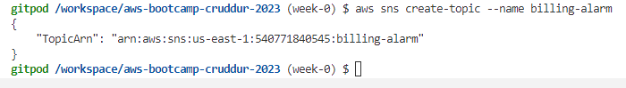
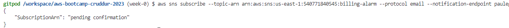
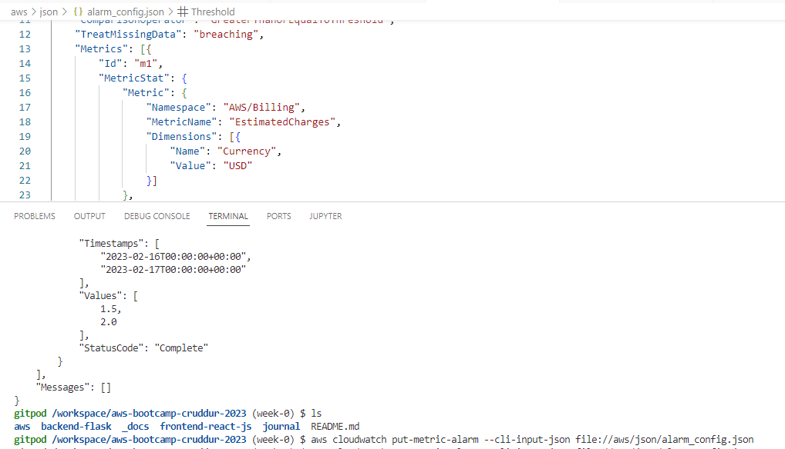
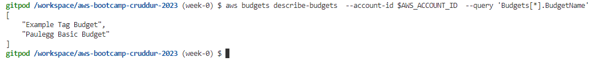
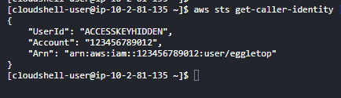
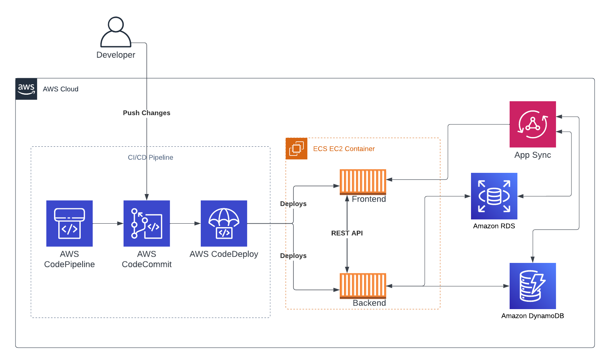

# Week 0 — Billing and Architecture

## Required Homework/Tasks

### GitPod and AWS CLI

GitPod was entirely new to me, but the Youtube videos made it easy to get up and running.  I am now editing my journal entries in my GitPod workspace instead of a local VScode install.

I've also previously used the AWS CLI, but now I needed to get this working in the GitPod workspace, again the edits to gitpod.yml provided by AB made it easy to get this installed, here is an example of the AWS CLI working with my new AWS user:


I've used the environment variables in GP to store my AWS credentials and configured GP env to remember them across relaunch.


### Billing Alarms 

I have enabled the billing alert preferences in Billing -> Billing Preferences


### SNS Topic Creation

I completed this, straightforwardly in the AWS CLI while using my GP workspace:

```sh
aws sns create-topic --name billing-alarm
```

Here's the image:




Using the following, I've created the subscription against my own email:

```sh
aws sns subscribe \
    --topic-arn TopicARN \
    --protocol email \
    --notification-endpoint myname@myemail.com
```


Here's the image:



I confirmed this in my email.


### Cloudwatch Alarm

The creation of a cloudwatch alarm was also succesful, this is something I've completed in the past, but only by using the console, not via the AWS CLI:




### AWS Budgets

Next, the creation of a budget using the AWS CLI.  




### AWS Cloudshell

Cloudshell is a great tool.  All you need is your usual AWS console login into a web browser can you can launch Cloudshell right into the browser.  It runs as a fully fledged shell with 1gb of local home space.  The AWS CLI tools are ready to go and you assume a role based on your currently logged in user, here's an example of the shell running (note I've obscured the output details of the account ID and access key name).




### Recreate Conceptual Architectural Design - Napkin


### Recreate Logcal Architectural Diagram - Lucid


[Lucid Charts Share Link](https://lucid.app/lucidchart/431475ba-5e01-4738-8b24-c06acb84100c/edit?viewport_loc=-282%2C-86%2C2408%2C1592%2C0_0&invitationId=inv_2df85908-1a39-4f63-8b20-ae36742f2ed1)
 


### CI CD Diagram


I have also attempted a basic logical diagram of the CI CD flow.  I think this will need refinement as it shows the deployment direct to EC2 containers as services in the cluster.  I think later we will probably need to include a build image stage that push our containers to the AWS container registry.

Additionally, we may want to build out IaC using CloudFormation to keep control over the creation/configuration of the AWS services themselves.


