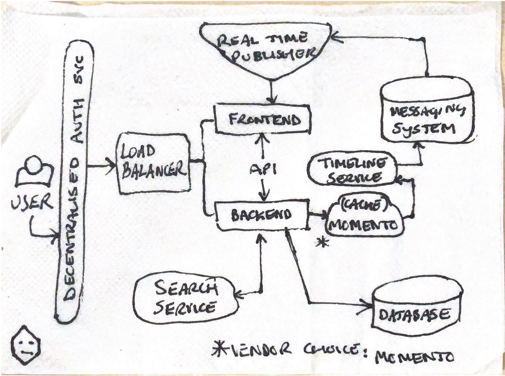
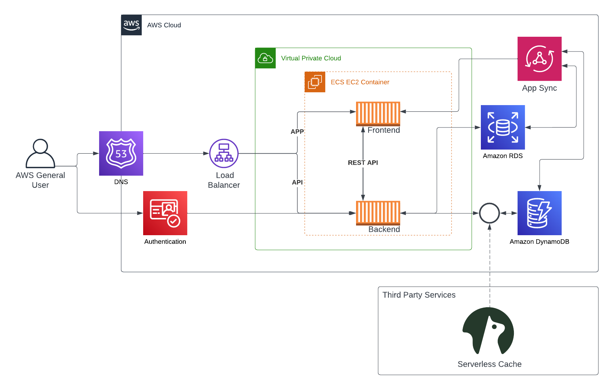

# Week 0 — Billing and Architecture

## Required Homework/Tasks

### Install and Verify AWS CLI 

 Gitpod or Github Codespaces...

In order to prove that I am able to use the AWS CLI...

### Recreate Conceptual Architectural Design - Napkin

### Recreate Logcal Architectural Diagram - Lucid

[Lucid Charts Share Link](https://lucid.app/lucidchart/431475ba-5e01-4738-8b24-c06acb84100c/edit?viewport_loc=-282%2C-86%2C2408%2C1592%2C0_0&invitationId=inv_2df85908-1a39-4f63-8b20-ae36742f2ed1)
 