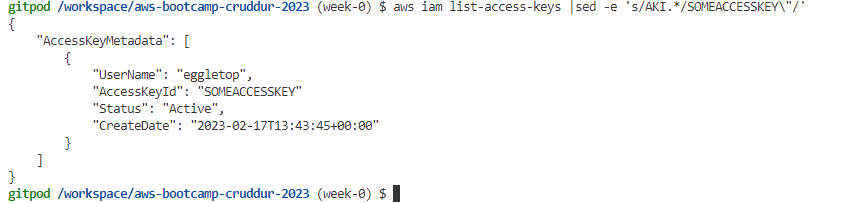

# Week 0 — Billing and Architecture

## Required Homework/Tasks

### GitPod and AWS CLI

GitPod was entirely new to me, but the Youtube videos made it easy to get up and running.  I am now editing my journal entries in my GitPod workspace instead of a local VScode install.

I've also previously used the AWS CLI, but now I needed to get this working in the GitPod workspace, again the edits to gitpod.yml provided by AB made it easy to get this installed, here is an example of the AWS CLI working with my new AWS user:

### Recreate Conceptual Architectural Design - Napkin

### Recreate Logcal Architectural Diagram - Lucid

[Lucid Charts Share Link](https://lucid.app/lucidchart/431475ba-5e01-4738-8b24-c06acb84100c/edit?viewport_loc=-282%2C-86%2C2408%2C1592%2C0_0&invitationId=inv_2df85908-1a39-4f63-8b20-ae36742f2ed1)
 