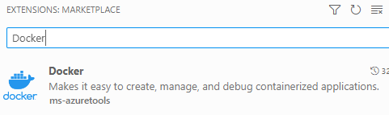
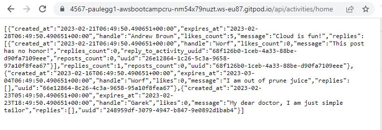
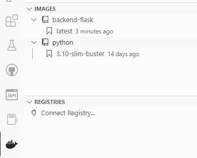
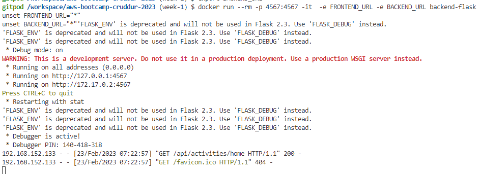
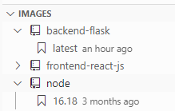
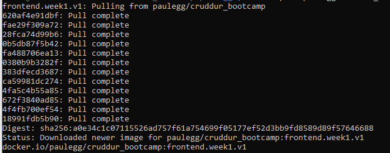
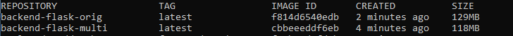
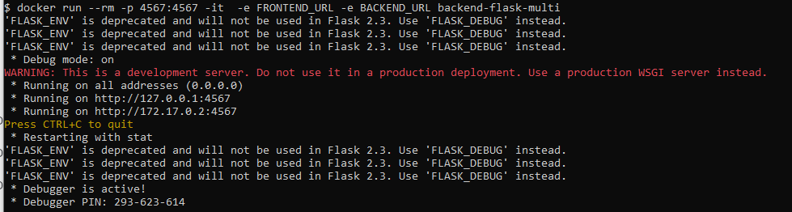
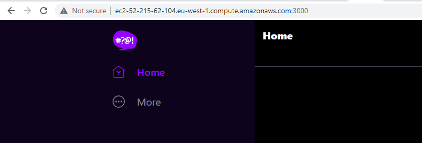

# Week 1 — App Containerization

## Containers, gitpod and Docker

This week I have been working to take the two core components of the application, the frontend and the backend and containerise them using Docker.  This is a precursor to deploying the components as containers in ECS.  It also allows local development and testing directly with containers.

Using gitpod launched from the github repo is again the simplest way to develop.  There is a Docker extension for VSCode that should be preinstalled, however I had to install it manually from the marketplace the first time.  You may have to as well.  It is this extension:



## Containerization of the Backend

### Testing at the command with Python

The backend application is found under backend-flask/ in the repo.  It is a python flask application and can be easily tested on the command line.   There is a python requirements file that is used with pip to install the flask and flask-cors prereqs.  To run and test do :

```sh
cd backend-flask
pip3 install -r requirements.txt
export FRONTEND_URL="*"
export BACKEND_URL="*"
python3 -m flask run --host=0.0.0.0 --port=4567
cd ..
```

This should run the backend, you can test the APIs there return JSON, follow these steps:

- Unlock the port (4567) on the PORTS tab
- Right click and open the link associated with port 4567
- You will need to append a valid URL - '/api/activities/home'

You should see a valid JSON response



### Create the Dockerfile

You are now ready to convert these steps into a Dockerfile so that you can build a container to simplify the deployment and launch of the backend.

The Docker file needs to go in the backend-flask folder - 'backend-flask/Dockerfile'.  Create this file, here's the content:

```Dockerfile
FROM python:3.10-slim-buster

WORKDIR /backend-flask

COPY requirements.txt requirements.txt
RUN pip3 install -r requirements.txt

COPY . .

ENV FLASK_ENV=development

EXPOSE ${PORT}
# python3 -m flask run --host=0.0.0.0 --port=4567
CMD [ "python3", "-m" , "flask", "run", "--host=0.0.0.0", "--port=4567"]
```

Next up you can build the container, this actually creates the container within the docker framework.

### Build the BE Container

Build the container using the following.  Ensure you are in the GitPod Repo Root.

```sh
cd $GITPOD_REPO_ROOT
docker build -t  backend-flask ./backend-flask
```

This will build your image and you should see it in the Docker extension on the side bar.  Notice you have the base image requested in the FROM line in the Dockerfile and your new backend-flash image:



The container images can also be listed with

```sh
docker image ls
```
You should see

```sh
REPOSITORY      TAG                IMAGE ID       CREATED         SIZE
backend-flask   latest             c964c1371d44   9 minutes ago   129MB
python          3.10-slim-buster   b5d627f77479   2 weeks ago     118MB
```

You are now ready to test running your backend container.

### Running the BE Container

The container can be run using the docker command line tool.  You need to specify the port mapping in order to publish port 4567.  It is also necessary at this stage to provide some URL environment variables, or the application with hit an HTTP 500 server error.  

There are a few ways to pass the required env vars in, here's an example using -e on the docker run command line.

```sh
export FRONTEND_URL="*"
export BACKEND_URL="*"
docker run --rm -p 4567:4567 -it  -e FRONTEND_URL -e BACKEND_URL backend-flask
unset FRONTEND_URL="*"
unset BACKEND_URL="*"
```

The above commands should be successful and should launch a container right from the gitpod terminal/workspace.



Now test the access in the browser by ensure the port is unlocked in the ports tab and clicking the link.  Remember to suffix with a valid api entry point such as the /api/activities/home.  You should get the same valid JSON response as earlier.

You will notice that docker runs in the foreground and doesn't relinquish your shell.  Ctrl-C and run it again with the '-d' option, it will run in the background.  This allows you to inspect the running container with 'docker ps' or 'docker logs'.

```sh
docker run --rm -p 4567:4567 -it  -e FRONTEND_URL -e BACKEND_URL -d backend-flask
```

## Containerization of the Frontend

Now you have a container that we can launch to run the backend, you need to create the frontend container.

The frontend application is found under frontend-react-js/ in the repo.  It is a React application and requires node and various modules to run.  You need to run npm install to get this working.

### NPM Install

Simply do:

```sh 
cd $GITPOD_REPO_ROOT
cd frontend-react-js
npm i
```

This will take a few minutes to install.  You should see this somewhere near the bottom of the output.

```sh
added 1471 packages, and audited 1472 packages in 22s
```

### Create FE Dockerfile

The FE container, of course, also needs a Dockerfile.  Create this in the frontend-react-js folder, - 'Dockerfile'.

```dockerfile
FROM node:16.18

ENV PORT=3000

COPY . /frontend-react-js
WORKDIR /frontend-react-js
RUN npm install
EXPOSE ${PORT}
CMD ["npm", "start"]
```

This container is a bit easier, you are already ready to build it:

```sh
cd $GITPOD_REPO_ROOT
docker build -t frontend-react-js ./frontend-react-js
```

The container will now show up in the Docker extension of VSCode, alongside the new base layer, node.



### Run FE Container

Now it is built, you can run the FE container from the command line.  Again, remember to background it with -d.

```sh
docker run -p 3000:3000 -d frontend-react-js
```

Again, check the ports tab to ensure the new frontend port (3000) is unlocked and test in the browser.  If all is well you now see the Cruddur! front page!

##  Docker Compose

With more than one container in an application, it is very useful to orchestrate their launch and control.  This is done with Docker Compose.

I created a docker-compose.yml file which needs to sit at the root of the project.   Note that I had a problem with the npm install seeming not to work once the container was launched, which prevented the front end from launching through docker compose.  I had a quick fix of running 'npm i' as per the build steps, but this should have been covered by the npm install tasks in the docker file.  It turned out I needed to mount an additional volume (- /frontend-react-js/node_modules). This is included in the compose file below.

```yaml
version: "3.8"
services:
  backend-flask:
    environment:
      FRONTEND_URL: "https://3000-${GITPOD_WORKSPACE_ID}.${GITPOD_WORKSPACE_CLUSTER_HOST}"
      BACKEND_URL: "https://4567-${GITPOD_WORKSPACE_ID}.${GITPOD_WORKSPACE_CLUSTER_HOST}"
    build: ./backend-flask
    ports:
      - "4567:4567"
    volumes:
      - ./backend-flask:/backend-flask
  frontend-react-js:
    environment:
      REACT_APP_BACKEND_URL: "https://4567-${GITPOD_WORKSPACE_ID}.${GITPOD_WORKSPACE_CLUSTER_HOST}"
    build: ./frontend-react-js
    ports:
      - "3000:3000"
    volumes:
      - ./frontend-react-js:/frontend-react-js
      - /frontend-react-js/node_modules

# the name flag is a hack to change the default prepend folder
# name when outputting the image names
networks: 
  internal-network:
    driver: bridge
    name: cruddur
    
```

The extension in VScode should mean that the docker-compose.yml file is recognised in your VScode file explorer.  You should be able to right-click the file and be given an option for 'Compose up'.  Clicking this will build and launch both containers in a single click.  Alternatively, you can use the docker commandline:

```sh
cd $GITPOD_REPO_ROOT
docker compose up
```

##  Notifications 

The notifications functionality was entirely missing from the application.  I successfully added the nofifications to both the back and frontend components of the application and also updated the openapi spec.  

### Backend - create notifications_activities.py

As shown here, the notifications_activites.py was created, it is almost a clone of the home_activities.py file with a few simple changes such as the class name.  I also change some of the message text and uuids so that the differences could be seen on the rendered page:

```python
from datetime import datetime, timedelta, timezone
class NotificationsActivities:
  def run():
    now = datetime.now(timezone.utc).astimezone()
    results = [{
      'uuid': '68f126b0-1ceb-4a33-88be-d90fa7109fff',
      'handle':  'Bob Notkate',
      'message': 'Did we get the notification!',
      'created_at': (now - timedelta(days=2)).isoformat(),
      'expires_at': (now + timedelta(days=5)).isoformat(),
      'likes_count': 5,
      'replies_count': 1,
      'reposts_count': 0,
      'replies': [{
        'uuid': '26e12864-1c26-5c3a-9658-97a10f8fea67',
        'reply_to_activity_uuid': '68f126b0-1ceb-4a33-88be-d90fa7109fff',
        'handle':  'Worf',
        'message': 'This post has no honor!',
        'likes_count': 0,
        'replies_count': 0,
        'reposts_count': 0,
        'created_at': (now - timedelta(days=2)).isoformat()
      }],
    },
    {
      'uuid': '66e12864-8c26-4c3a-9658-95a10f8fea67',
      'handle':  'Worf',
      'message': 'I am out of prune juice',
      'created_at': (now - timedelta(days=7)).isoformat(),
      'expires_at': (now + timedelta(days=9)).isoformat(),
      'likes': 0,
      'replies': []
    },
    {
      'uuid': '248959df-3079-4947-b847-9e0892d1bab4',
      'handle':  'Garek',
      'message': 'My dear doctor, I am just simple tailor',
      'created_at': (now - timedelta(hours=1)).isoformat(),
      'expires_at': (now + timedelta(hours=12)).isoformat(),
      'likes': 0,
      'replies': []
    }
    ]
    return results
```

### Backend - amend app.py

The new service object for notifications needed to be imported, line 7 in app.py:

```diff
+  from services.notifications_activities import *
```

In addtion, the app routing needed to be added to map the entry point url (with HTTP GET) to the notifications service.

```python
@app.route("/api/activities/notifications", methods=['GET'])
def data_notifications():
  data = NotificationsActivities.run()
  return data, 200
```

### Frontend - App.js
  
The required changes to the App.js page were to import the js from a new NotifcationsFeedPage (show further below) and to add the path to the Router (createBrowserRouter).

Here are the changes to App.js.  The full file can be seen in the repo.

Line 4 addition:
```javascript
import NotificationsFeedPage from './pages/NotificationsFeedPage';
```
Lines 24 to 27 addition:

```javascript
 {
    path: "/notifications",
    element: <NotificationsFeedPage />
  },
```

### Frontend - NotificationsFeedPage.js

The notifications page is almost the same as the home page. This allowed me to copy the 'src/pages/HomeFeed.js' page to 'src/pages/NotificationsFeed.js'.  I won't show the full file here for brevity, just the changes:

Line 1:

```diff
+  import './NotificationsFeedPage.css';
-  import React from "react";
```

Line 23:

```diff
    try {
-      const backend_url = `${process.env.REACT_APP_BACKEND_URL}/api/activities/home` 
+      const backend_url = `${process.env.REACT_APP_BACKEND_URL}/api/activities/notifications`
       const res = await fetch(backend_url, {
```

Line 60

```diff
  return (
    <article>
-      <DesktopNavigation user={user} active={'home'} setPopped={setPopped} />
+      <DesktopNavigation user={user} active={'notfications'} setPopped={setPopped} />
       <div className='content'>
```      


## PostGres and DynamoDB

It is necessary to get Postgres and DynamoDB working because they will be needed for future stages where we use persistent storage with Cruddur.  This is done now, during the docker container build stages so that the containers needed to run the development environment are all ready and complete.  The steps involve adding two new container builds to the docker-compose.yml file. The additions are shown below.

### DynamoDB changes to docker-compose.yml

```dockerfile
  dynamodb-local:
    # https://stackoverflow.com/questions/67533058/persist-local-dynamodb-data-in-volumes-lack-permission-unable-to-open-databa
    # We needed to add user:root to get this working.
    user: root
    command: "-jar DynamoDBLocal.jar -sharedDb -dbPath ./data"
    image: "amazon/dynamodb-local:latest"
    container_name: dynamodb-local
    ports:
      - "8000:8000"
    volumes:
      - "./docker/dynamodb:/home/dynamodblocal/data"
    working_dir: /home/dynamodblocal
```

### Postgres changes to docker-compose.yml

```dockerfile
  db:
    image: postgres:13-alpine
    restart: always
    environment:
      - POSTGRES_USER=postgres
      - POSTGRES_PASSWORD=password
    ports:
      - '5432:5432'
    volumes: 
      - db:/var/lib/postgresql/data
```

### Other items - volumes

I also added the required volumes local to specify that the volumes are local to the docker host.

```dockerfile
volumes:
  db:
    driver: local
```

I also added the psql client to the gitpod.yml file, this ensure it is installed on the launch of the gitpod environment.  Note also I've added an npm install.  Not strictly required because the docker build installs this inside the FE container, but it is useful to have it on the gitpod workspace environment too.

```yaml
  - name: npm-install
    init: |
      cd /workspace/aws-bootcamp-cruddur-2023/frontend-react-js
      npm i
      exit
  - name: postgres
    init: |
      curl -fsSL https://www.postgresql.org/media/keys/ACCC4CF8.asc|sudo gpg --dearmor -o /etc/apt/trusted.gpg.d/postgresql.gpg
      echo "deb http://apt.postgresql.org/pub/repos/apt/ `lsb_release -cs`-pgdg main" |sudo tee  /etc/apt/sources.list.d/pgdg.list
      sudo apt update
      sudo apt install -y postgresql-client-13 libpq-dev
```

Once these items are in the place, the two new docker containers succesfully launch, you will find you now have 4 containers on a complete 'docker compose up',

```sh
gitpod /workspace/aws-bootcamp-cruddur-2023 (week-1) $ docker ps
CONTAINER ID   IMAGE                                         COMMAND                  CREATED          STATUS          PORTS                                       NAMES
3d4be41ab3bf   aws-bootcamp-cruddur-2023-backend-flask       "python3 -m flask ru…"   19 minutes ago   Up 19 minutes   0.0.0.0:4567->4567/tcp, :::4567->4567/tcp   aws-bootcamp-cruddur-2023-backend-flask-1
cc51920cb0a0   aws-bootcamp-cruddur-2023-frontend-react-js   "docker-entrypoint.s…"   19 minutes ago   Up 19 minutes   0.0.0.0:3000->3000/tcp, :::3000->3000/tcp   aws-bootcamp-cruddur-2023-frontend-react-js-1
dba93d8ce24e   postgres:13-alpine                            "docker-entrypoint.s…"   19 minutes ago   Up 19 minutes   0.0.0.0:5432->5432/tcp, :::5432->5432/tcp   aws-bootcamp-cruddur-2023-db-1
34f42429e7a4   amazon/dynamodb-local:latest                  "java -jar DynamoDBL…"   19 minutes ago   Up 19 minutes   0.0.0.0:8000->8000/tcp, :::8000->8000/tcp   dynamodb-local
```

# Other Challenges

## Run the dockerfile CMD as external script

I was a little unsure about this on first reading, but I think the task here is to investigate and run the CMD as a script, the "shell form" rather than using the "exec" form.

I did this by adding a simple one line script to the root of the flask app/container in the repo and then calling this script from the Dockerfile.  The script was called runflask.sh and simply contains:

```sh
python3 -m flask run --host=0.0.0.0 --port=4567
```

But clearly could be more complex and contain other tasks.

The Dockerfile becomes (old CMS commented out), this is just the final few lines, showing the only change.

```dockerfile
...
EXPOSE ${PORT}
# python3 -m flask run --host=0.0.0.0 --port=4567
#CMD [ "python3", "-m" , "flask", "run", "--host=0.0.0.0", "--port=4567"]
COPY runflask.sh runflask.sh
CMD sh runflask.sh
...
```

I have changed the dockerfile back to the exec form now but left both the alternative commented out.

## Create a dockerhub repo and push images

I also created a docker hub account and began pushing the images to a new repository using the command line.  The process is to login using your docker credentials/token and then work to tag and push your images.  As follows, for the frontend :

```sh
$ docker login -u paulegg
$ docker tag fa7be0defd8b paulegg/cruddur_bootcamp:frontend.week1.v1
$ docker push paulegg/cruddur_bootcamp:frontend.week1.v1
```

I was able to test pulling this container down to an alternative machine with docker pull:

```sh
$ docker pull paulegg/cruddur_bootcamp:frontend.week1.v1
```

Here is the output:



I repeated this for the other container built in our collection:

```sh
$ docker tag d8b0bd42a1bf paulegg/cruddur_bootcamp:backend.week1.v1
$ docker push paulegg/cruddur_bootcamp:backend.week1.v1
```

## Get Docker running on a local machine

Just a side note to say that I tested the pull from my new docker repo and the multi-stage section below on my local desktop and was able to get our containers running on that machine, outside of GitPod.  I have WSL on a Windows machine here to achieve this.  Some of the screen shots here you see are from that desktop.

## Investigate multi-stage docker builds

I did some reading on multi-stage docker builds.  There is good documentation at [Docker Multistage](https://docs.docker.com/build/building/multi-stage/).  I only tested this for the backend, but it could of course be extended to the frontend container as well.  For larger and more complex images the space and efficiency savings could be quite large, but for our project I don't think it is really necessary, but it was an education to investigate it! I created a new Dockerfile as shown here:

```dockerfile
FROM python:3.10-slim-buster

# Create the virtual environment.
RUN python3 -m venv /venv
ENV PATH=/venv/bin:$PATH

COPY requirements.txt .
RUN pip3 install -r requirements.txt

FROM python:3.10-slim-buster

# Copy the virtual environment from the first stage.
COPY --from=0 /venv /venv
ENV PATH=/venv/bin:$PATH

WORKDIR /backend-flask
COPY . .

ENV FLASK_ENV=development
# ENV FRONTEND_URL="*"
# ENV BACKEND_URL="*"

EXPOSE ${PORT}
# python3 -m flask run --host=0.0.0.0 --port=4567
CMD [ "python3", "-m" , "flask", "run", "--host=0.0.0.0", "--port=4567"]
```

Notice how the dependencies (requirements.txt) are created in the first image and we use a second stage to copy what is required into the second image. This separates an environment preparation (or in more complex cases, compile phases) and a deployment phase.  It would allow, for example, with compiled languages,the ability to leave compilers and other framework in a development image while delivering binary release only for the second stage.  

The image successfully built:



The backend could be successfully run:



I want to keep my repo and progress clean and easy to troubleshoot, so for now, this experiment will be kept only in Dockerfile.multi as a backup in the backend-flask folder.

## Create an ec2 instance with docker installed and get the containers running

For this challenge, I started with a terraform build of an ec2 instance because I wanted the build to be easily repeatable.  I wanted to ensure I could destroy the entire environment with a single 'terraform destroy' and then build it again with 'plan/apply'.  This way I could build and test and then destroy without generating any additional cost.  The ec2 instance would be within the free tier and would only exist for the time I needed it in order to test.  The 'user_data' script for the ec2 instance is responsible for installing docker and pulling down the images.  The terraform code also creates an elastic IP to assoiciate with the instance and ensures that the VM is secured with a security group (also created with terraform).  

Here is a snippet of the terraform to create the vm:

```terraform
resource "aws_instance" "vm" {
    ami           = data.aws_ami.amazon2.id
    instance_type = "t3.micro"

    key_name = data.aws_key_pair.key.key_name
    subnet_id = data.aws_subnet.vpn_subnet.id
    vpc_security_group_ids = [aws_security_group.ssh-allowed.id]

    user_data = <<-EOF
      #!/bin/bash
      set -ex
      sudo yum update -y
      sudo amazon-linux-extras install docker -y
      sudo service docker start
      sudo docker pull paulegg/cruddur_bootcamp:frontend.week1.v1
      sudo docker pull paulegg/cruddur_bootcamp:backend.week1.v1
    EOF


    tags  = {
       "Name" = "cruddur ec2 and docker 01"
    }
}
```

I need to fully document this, but it works a treat, here is a snapshot of the working app within an ec2 instance:


