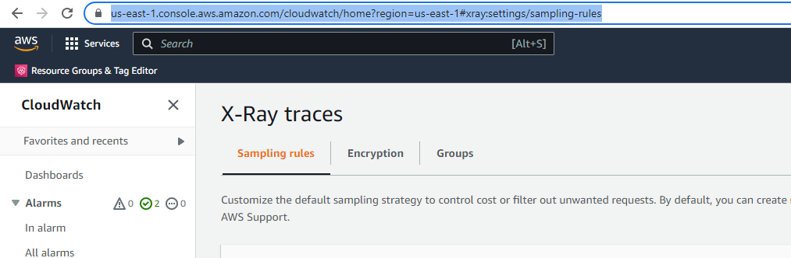
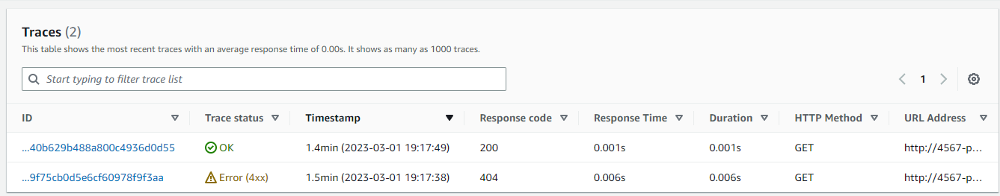
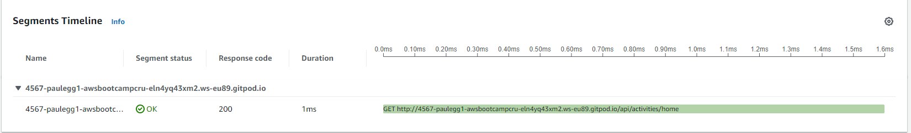
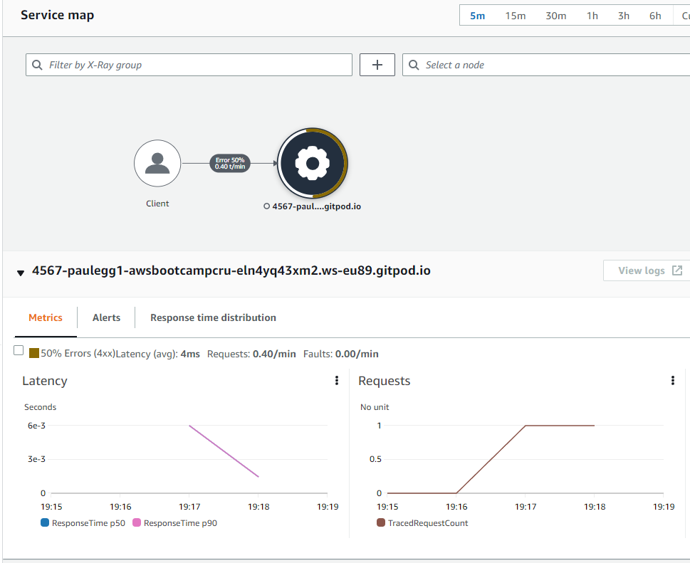

# Week 2 — Distributed Tracing

## Backend instrumentation with OTEL/Honeycomb

The first task for this week was to get tracing working for the backend part of the application using Honeycomb.io.  Honeycomb is a software tracing and debugging platform that uses the OTEL (Open Telemetry) framework to collect detailed traces from your application.

We start by instrumenting the backend flask application by installing the python prerequisite packages and initialising automatic instrumention.

### Install requirements with pip

First step is to add the following packages to the requirements.txt and to run pip install.

New addtions to requirements.txt

```sh
opentelemetry-api 
opentelemetry-sdk 
opentelemetry-exporter-otlp-proto-http 
opentelemetry-instrumentation-flask 
opentelemetry-instrumentation-requests
```
Install with pip

```sh
$ pip3 install -r requirements.txt
```

### OTEL related environment variables

Once the requirements are in place, you can import the OTEL classes and start using the basic instrumentation.  First though, we need some environment variables.  The access to your Honeycomb account in order to send traces relies on your account API Key, which is available in your Honeycomb account home page under `https://ui.honeycomb.io/paulegg-cruddur/environments/${YOUR_ENV_NAME}/api_keys` This is best navigated to from the environments page - `https://ui.honeycomb.io/paulegg-cruddur/environments`.  You will also need to set the target URL and a Service Name.  That service name will be used to identify your application in the portal as the service dataset.  The variables then are:

```sh
      OTEL_EXPORTER_OTLP_ENDPOINT: "https://api.honeycomb.io"
      OTEL_EXPORTER_OTLP_HEADERS: "x-honeycomb-team=${HONEYCOMB_API_KEY}"
      OTEL_SERVICE_NAME: "backend-flask"
```

These can be set both for the current GP shell and for future GP launches using export and gp env respectively:

```sh
export OTEL_EXPORTER_OTLP_ENDPOINT="https://api.honeycomb.io"
gp env OTEL_EXPORTER_OTLP_ENDPOINT="https://api.honeycomb.io"
export OTEL_EXPORTER_OTLP_HEADERS="x-honeycomb-team=${HONEYCOMB_API_KEY}"
gp env OTEL_EXPORTER_OTLP_HEADERS="x-honeycomb-team=${HONEYCOMB_API_KEY}"
export OTEL_SERVICE_NAME="backend-flask"
gp env OTEL_SERVICE_NAME="backend-flask"
```

Now is also a good time to add these to the docker-compose.yml in the section for the backend-flask application:

```diff
    environment:
      FRONTEND_URL: "https://3000-${GITPOD_WORKSPACE_ID}.${GITPOD_WORKSPACE_CLUSTER_HOST}"
      BACKEND_URL: "https://4567-${GITPOD_WORKSPACE_ID}.${GITPOD_WORKSPACE_CLUSTER_HOST}"
+     OTEL_EXPORTER_OTLP_ENDPOINT: "https://api.honeycomb.io"
+     OTEL_EXPORTER_OTLP_HEADERS: "x-honeycomb-team=${HONEYCOMB_API_KEY}"
+     OTEL_SERVICE_NAME: "backend-flask"
    build: ./backend-flask
    ports:
```

You can check your environment as follows:

```sh
gitpod /workspace/aws-bootcamp-cruddur-2023/backend-flask (main) $ env |grep OTEL
OTEL_EXPORTER_OTLP_HEADERS=x-honeycomb-team=egYOURAPIKEYHEREaaa
OTEL_EXPORTER_OTLP_ENDPOINT=https://api.honeycomb.io
OTEL_SERVICE_NAME=backend-flask
```
### Basic instrumentation

Now you are ready to edit app.py to add in the required class imports, initialize the tracing and exporter and begin tracing.  Below shows the changes required to app.py:

First, the imports, I added:

```python
# HC / OTEL
from opentelemetry import trace
from opentelemetry.instrumentation.flask import FlaskInstrumentor
from opentelemetry.instrumentation.requests import RequestsInstrumentor
from opentelemetry.exporter.otlp.proto.http.trace_exporter import OTLPSpanExporter
from opentelemetry.sdk.trace import TracerProvider
from opentelemetry.sdk.trace.export import BatchSpanProcessor
```

Then, ABOVE the `app = Flask(__name__)` line, you need to initialize the tracer and create an exporter:

```python
# Initialize tracing and an exporter that can send data to Honeycomb
provider = TracerProvider()
processor = BatchSpanProcessor(OTLPSpanExporter())
provider.add_span_processor(processor)
trace.set_tracer_provider(provider)
tracer = trace.get_tracer(__name__)
```

Finally, below the `app = Flask(__name__)` line, start the instrumentation:

```python
# HC Initialize automatic instrumentation with Flask
FlaskInstrumentor().instrument_app(app)
RequestsInstrumentor().instrument()
```

You are now ready to launch the backend docker container.  Basic instrumentation should work, here is a screenshot from the Honeycomb portal:


### Custom Spans

To provide more detailed traces, to identify and drilldown on specific parts of your application it is useful to create new spans to better show/describe what is happening within your application.  This permits more detail within the traces and will show named, broken out spans that represent specific operations or API calls, for example, a particular page render or API call or a database request.

The first task in order to create a new span is to acquire a tracer as follows:

```python
from opentelemetry import trace

tracer = trace.get_tracer("home.activities")
```

Once we have a handle on the tracer, we can create a new span.  Spans are created using a parent-child model, such that you can see where a parent span drops into a child trace / request.  The creation of a span always uses the current active span as the parent.  You can create a span using `tracer.start_as_current_span("your-span-name"):`  It is a new python block, so everything needs to be appropriately indented after the colon.  

I first created and tested a new span in the home activites service.  The tracer start comes right after we drop into run():

```python
...
class HomeActivities:
  def run():
    with tracer.start_as_current_span("home-activites-mock-data"):
      now = datetime.now(timezone.utc).astimezone()
      results = [{ ...
...
```

The next step is to add similar basic instrumentation to the other python services.  

Testing worked well for home activites, here is a trace in Honeycomb that shows the extra span.  You can see the naming I used - 'home-activities-mock-data':


## Backend instrumentation with AWS X-Ray

Next I worked on the the implementation of X-Ray instrumentation.  This was successful, at the time of writing, only to the base level of instrumentation.  I have not yet implemented addition segments or subsegments. If time allows I'll come back and attempt it.

The first step is to setup the environment.  Some environment variables are needed as well as the AWS X-Ray SDK for Python.  The environment variables, as with previous items can be added to your gitpod configuration:

```sh
export AWS_REGION="us-east-1"
gp env AWS_REGION="us-east-1"
```

The AWS X-Ray SDK can be installed using pip.  I added the following line to the requirements.txt file and ran `pip install -r requirements.txt`:

```sh
aws-xray-sdk
```

There are 2 import lines that you will need to add the the `app.py` file, these are to import the xray_recorder and the `XRayMiddleware`.

In addition, there are three X-Ray initialization lines that need added *after* the `app = Flask(__name__)` line.  See the changes below.

```python
...
# XRAY
from aws_xray_sdk.core import xray_recorder
from aws_xray_sdk.ext.flask.middleware import XRayMiddleware

...

app = Flask(__name__)
# Initialise the AWS Xray stuff
# https://docs.aws.amazon.com/xray/latest/devguide/xray-sdk-python-configuration.html
xray_url = os.getenv("AWS_XRAY_URL")
xray_recorder.configure(service='backend-flask', dynamic_naming=xray_url)
XRayMiddleware(app, xray_recorder)

...
```

Next up, there is a new AWS json file to add under `/aws/json/` as `xray.json`.  I set the service name to backend-flask so that we can identify the portion of the application we are instrumenting when we view traces in the X-Ray console.

```json
{
    "SamplingRule": {
        "RuleName": "Cruddur",
        "ResourceARN": "*",
        "Priority": 9000,
        "FixedRate": 0.1,
        "ReservoirSize": 5,
        "ServiceName": "backend-flask",
        "ServiceType": "*",
        "Host": "*",
        "HTTPMethod": "*",
        "URLPath": "*",
        "Version": 1
    }
  }
```

That is the core application setup complete.  Before we can start instrumenmting though, there are a few AWS requirements that we need to sort out.  Firstly we need to create an X-Ray group and a sampling rule.  This is possible in the AWS Web console, but consistency is best acheived through the use of the `xray.json` file above and the AWS CLI. 

I created the group as follows:

```sh
aws xray create-group    --group-name "Cruddur"    --filter-expression "service(\"backend-flask\")
```

The sampling rule, referring to the previously created json file:

```sh
aws xray create-sampling-rule --cli-input-json file://aws/json/xray.json
```

The final component we need is an X-Ray daemon service.  This is because the X-Ray service relies on an intermediary component to recieve and forward the traces.  This can be seen circled in the image below (from: https://floqast.com/engineering-blog/post/using-aws-x-ray/)


This daemon service could be run locally, on a container on ECS or on a docker container launched from our environment.  Andrew Brown kindly did the leg work and demonstrated how to get this running as a docker container which we can place directly in `docker-compose.yml` as follows:

```dockerfile
  xray-daemon:
    image: "amazon/aws-xray-daemon"
    environment:
      AWS_ACCESS_KEY_ID: "${AWS_ACCESS_KEY_ID}"
      AWS_SECRET_ACCESS_KEY: "${AWS_SECRET_ACCESS_KEY}"
      AWS_REGION: "us-east-1"
    command:
      - "xray -o -b xray-daemon:2000"
    ports:
      - 2000:2000/udp
```

We also need some new environment variables in the `environment` section in the docker-compose file, I added these:

```diff
    environment:
      FRONTEND_URL: "https://3000-${GITPOD_WORKSPACE_ID}.${GITPOD_WORKSPACE_CLUSTER_HOST}"
      BACKEND_URL: "https://4567-${GITPOD_WORKSPACE_ID}.${GITPOD_WORKSPACE_CLUSTER_HOST}"
      OTEL_EXPORTER_OTLP_ENDPOINT: "https://api.honeycomb.io"
      OTEL_EXPORTER_OTLP_HEADERS: "x-honeycomb-team=${HONEYCOMB_API_KEY}"
      OTEL_SERVICE_NAME: "backend-flask"
+     AWS_XRAY_URL: "*4567-${GITPOD_WORKSPACE_ID}.${GITPOD_WORKSPACE_CLUSTER_HOST}*"
+     AWS_XRAY_DAEMON_ADDRESS: "xray-daemon:2000"
    build: ./backend-flask
```

With that all in place, I was ready to test!

The first challenge was finding my way around the AWS X-Ray console.  In the end I saved the URL that took me to the X-Ray traces pane.  



Once I found the right location though, the traces were there!



Here's a view of the segments timeline for the basic home page/trace.



Finally, a screenshot of the service map.




## Cloudwatch Logs integration into python

AWS Cloudwatch logs can be integrated with Python applications using the watchtower log handler, [Watchtower](https://pypi.org/project/watchtower/).  It needs to be installed as a python package by adding it to the `requirements.txt` file and running pip install.

```sh
pip install -r requirements.txt
```

We need to import `watchtower`, the `logging` library and `strftime` at the top of `app.py`:

```python
import watchtower
import logging
from time import strftime
```

Then we can use the following to initialize Cloudwatch logging:

```python
LOGGER = logging.getLogger(__name__)
LOGGER.setLevel(logging.DEBUG)
console_handler = logging.StreamHandler()
cw_handler = watchtower.CloudWatchLogHandler(log_group='cruddur')
LOGGER.addHandler(console_handler)
LOGGER.addHandler(cw_handler)
LOGGER.info("Top Level App.py Logger")
```

Something I learned about Flask was that it has what are termed 'decorators', they are functions that take another function as a parameter, modifies its behaviour and returns a function.  The Flask decorators allow us to inject new functionality in web applications.  There exist two interesting decorators, before_request and after_request.  I started investigating this is order to better understand this line, from Andrew's videos:

```python
@app.after_request
def after_request(response):
```

Anyway, with before_request and after_request we can perform various actions, as the names suggest, either before or after the request is processed.  With Cloudwatch logs we can use it to log any errors post request with:

```python
@app.after_request
def after_request(response):
    timestamp = strftime('[%Y-%b-%d %H:%M]')
    LOGGER.error('%s %s %s %s %s %s', timestamp, request.remote_addr, request.method, request.scheme, request.full_path, response.status)
    return response
```

The `after_request` decorator was placed in `app.py` around line 84.

I think what we have to do next to use the logger in a sub module, in for example the home activities service, is to import the logging library and then create a new logger using the `__name__` syntax, basically, this pattern:

```python
import logging

# create logger
module_logger = logging.getLogger(__name__) 

def some_function():
    module_logger.info('message from auxiliary module')
```

In `home_activities.py` then:

```python
from datetime import datetime, timedelta, timezone
from opentelemetry import trace
import logging

# create home logger
home_logger = logging.getLogger(__name__) 

tracer = trace.get_tracer("home.activities")

class HomeActivities:
  def run():
    home_logger.info('message from home activities module')
    with tracer.start_as_current_span("home-activites-mock-data"):

...

```