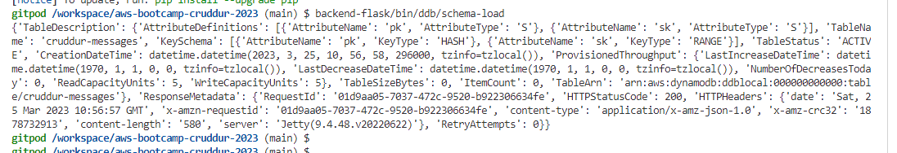

# Week 5 — DynamoDB and Serverless Caching

# STILL WIP #
## YES, I AM BEHIND. LIFE HAPPENS...  :( ##
### Hoping to catch up ###
## DDB Local - Schema Load

The schema load for DDB is achieved by using the Boto3 library.  First, add boto3 to the requirements.txt and run pip install so that we have it available locally to work with.

<Show this>

Then using `backend-flask\bin\ddb\schema-load`, create the schema:

## Cognito List Users

The cognito list users is a neat utility script that uses boto3 to grab our Cognito User details from the cognito pool. It relies on being able to get the Cognito Pool ID from the os.env.  This was also populated into 'gp env' as `AWS_COGNITO_USER_POOL_ID=us-east-1_dh4fakeidP`.  It works as expected and is called as a script under `~/bin/cognito/list-users`.

## Created PROD DynamoDB

Use the schema-load script in 'bin/ddb' to create the prod DynamoDB table.  Should work smoothly using the default AWS creds and region.  For me, creation was super-fast.   Check with 'list-tables'.  Don't forget to seed the data using the 'bin/ddb/seed' script.

Next, enable streams, doable in the AWS console with 'new image' attributes included.  Go to 'Exports and Streams' then 'DynamoDB Stream Details' and select 'New Image'.  This allows item-level changes to be detected.

### DDB VPC Endpoint ###

At the moment, this was also created manually in the AWS console, but I intend to recreate using TF.  This is my draft TF block for it.

'''terraform
  resource "aws_vpc_endpoint" "private-dynamodb" {
    vpc_id = aws_vpc.main.id
    service_name = "com.amazonaws.${var.region}.dynamodb"
    policy = <<POLICY
    {
    "Statement": [
        {
        "Action": "*",
        "Effect": "Allow",
        "Resource": "*",
        "Principal": "*"
        }
    ]
    }
    POLICY
  }
'''

For the manual creation, it is found under VPC, endpoints, select the AWS service for DynamoDB, the default VPC and the default (non-IGW) route table.

### Lambda ###

We need a Lambda trigger to handle the update of a new message.  Copy and paste the code from 'aws/lambdas/cruddur-messaging-stream.py' into a new Lamba called 'cruddur-messaging-stream'.  Remember to add the policy 'AWSLambdaInvocation-DynamoDB' to the role attached to the Lambda.

Also add a trigger under streams in DynamoDB, select the 'cruddur-messaging-stream' from the dropdown.