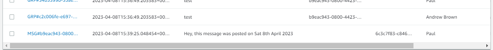
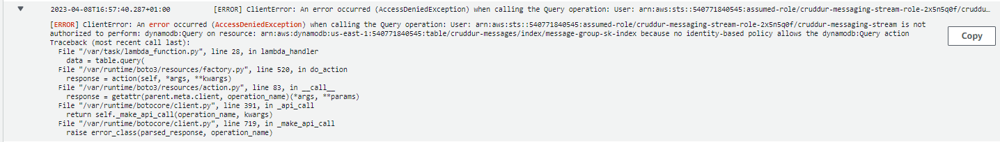
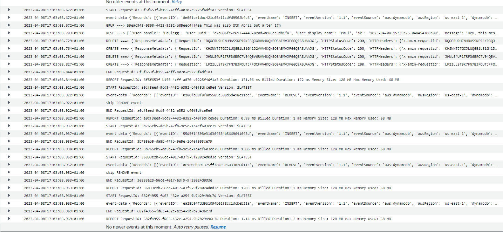

# Week 5 — DynamoDB and Serverless Caching

# STILL WIP #
## YES, I AM BEHIND. LIFE HAPPENS...  :( ##
### Hoping to catch up ###
## DDB Local - Schema Load

The schema load for DDB is achieved by using the Boto3 library.  First, add boto3 to the requirements.txt and run pip install so that we have it available locally to work with.

```diff
  rollbar
  Flask-AWSCognito
  psycopg[binary]
  psycopg[pool]
  psycopg[pool]
+ boto3
```

Then using `backend-flask\bin\ddb\schema-load`, create the schema, this worked just fine:

```python
#!/usr/bin/env python3

import boto3
import sys

attrs = {
  'endpoint_url': 'http://localhost:8000'
}

if len(sys.argv) == 2:
  if "prod" in sys.argv[1]:
    attrs = {}

ddb = boto3.client('dynamodb',**attrs)

table_name = 'cruddur-messages'


response = ddb.create_table(
  TableName=table_name,
  AttributeDefinitions=[
    {
      'AttributeName': 'message_group_uuid',
      'AttributeType': 'S'
    },
    {
      'AttributeName': 'pk',
      'AttributeType': 'S'
    },
    {
      'AttributeName': 'sk',
      'AttributeType': 'S'
    },
  ],
  KeySchema=[
    {
      'AttributeName': 'pk',
      'KeyType': 'HASH'
    },
    {
      'AttributeName': 'sk',
      'KeyType': 'RANGE'
    },
  ],
  GlobalSecondaryIndexes=[{
    'IndexName':'message-group-sk-index',
    'KeySchema':[{
      'AttributeName': 'message_group_uuid',
      'KeyType': 'HASH'
    },{
      'AttributeName': 'sk',
      'KeyType': 'RANGE'
    }],
    'Projection': {
      'ProjectionType': 'ALL'
    },
    'ProvisionedThroughput': {
      'ReadCapacityUnits': 5,
      'WriteCapacityUnits': 5
    },
  }],
  # provisioned is in the free tier as 5 and 5
  BillingMode='PROVISIONED',
  ProvisionedThroughput={
      'ReadCapacityUnits': 5,
      'WriteCapacityUnits': 5
  }
)

print(response)
```

Here's the screenshot:


## Cognito List Users

The cognito list users is a neat utility script that uses boto3 to grab our Cognito User details from the cognito pool. It relies on being able to get the Cognito Pool ID from the os.env.  This was also populated into 'gp env' as `AWS_COGNITO_USER_POOL_ID=us-east-1_dh4fakeidP`.  It works as expected and is called as a script under `~/bin/cognito/list-users`.   This proves VERY useful when troubleshooting issues with the direct messaging functions.

## Cognito Update User IDS ##

The update cognito user IDs script is useful for handling the user entries in the PSQL DB where we need to adjust/update the cognito user ID column.  This is here: `backend-flask/bin/db/update-cognito-userids`.

Here's the screenshot of it working:


## Created PROD DynamoDB

Use the schema-load script in 'bin/ddb' to create the prod DynamoDB table.  Should work smoothly using the default AWS creds and region.  For me, creation was super-fast.   Check with 'list-tables'.  Don't forget to seed the data using the 'bin/ddb/seed' script.

Next, enable streams, doable in the AWS console with 'new image' attributes included.  Go to 'Exports and Streams' then 'DynamoDB Stream Details' and select 'New Image'.  This allows item-level changes to be detected.

Create Trigger in DDB, in the console for Lambda Function `cruddur-messaging-stream`.  Batch size 1.  Activate on create.


### DDB VPC Endpoint ###

At the moment, this was also created manually in the AWS console, but I intend to recreate using TF.  This is my draft TF block for it.

'''terraform
  resource "aws_vpc_endpoint" "private-dynamodb" {
    vpc_id = aws_vpc.main.id
    service_name = "com.amazonaws.${var.region}.dynamodb"
    policy = <<POLICY
    {
    "Statement": [
        {
        "Action": "*",
        "Effect": "Allow",
        "Resource": "*",
        "Principal": "*"
        }
    ]
    }
    POLICY
  }
'''

For the manual creation, it is found under VPC, endpoints, select the AWS service for DynamoDB, the default VPC and the default (non-IGW) route table.


## A Listing Messages ##

This was a tough thing to implement for me.  Eventually got this working.  My commit on this changed 14  files with 203 additions and 86 deletions.  I need to document this more fully.

## B Listing Message Groups ##

Done.  To be documented

## C Creating a Message ##

Done.  To be documented

## D creating a new message group and message ##

Done.  To be documented

## E Updating a new Message group through DynamoDB Streams and a Trigger ##

### Lambda ###

We need a Lambda trigger to handle the update of a new message.  Copy and paste the code from 'aws/lambdas/cruddur-messaging-stream.py' into a new Lamba called 'cruddur-messaging-stream'.  Remember to add the policy 'AWSLambdaInvocation-DynamoDB' to the role attached to the Lambda.

Also add a trigger under streams in DynamoDB, select the 'cruddur-messaging-stream' from the dropdown.

### Bring app up using production DynamoDB ###

Comment the local AWS Endpoint out of `docker-compose.yml`

#AWS_ENDPOINT_URL: "http://dynamodb-local:8000"

Down and up the app.

Wow, this works.

 

### Lambda Trigger needs DDB update items ###

I created / added the GlobalSecondaryIndexes section in schema-load under `ddb`.  

The Lamdba for cruddur-messaging-stream works and I can see in the CloudWatch logs that it has been successful.

At first, I had a problem with the Lambda trigger due to missing the policy for DynamoDB (I gave it full access for now to make this work):

 

With the authorisation fixed, it works:

 


Add AmazonDynamoDBFullAccess for now.  Need to pare this back later.