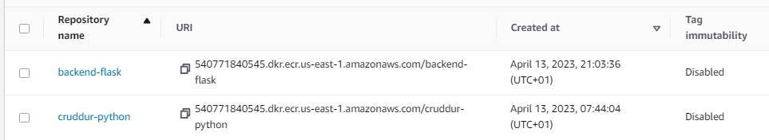
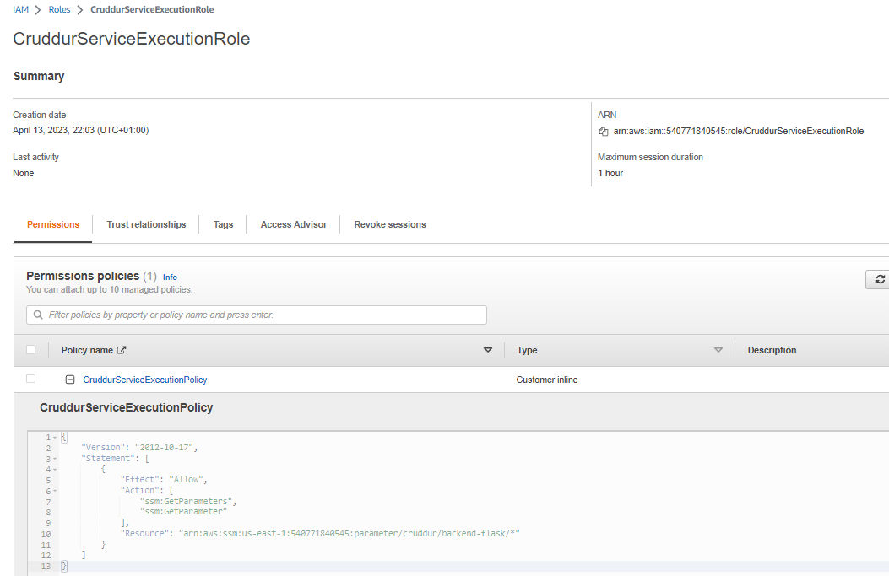
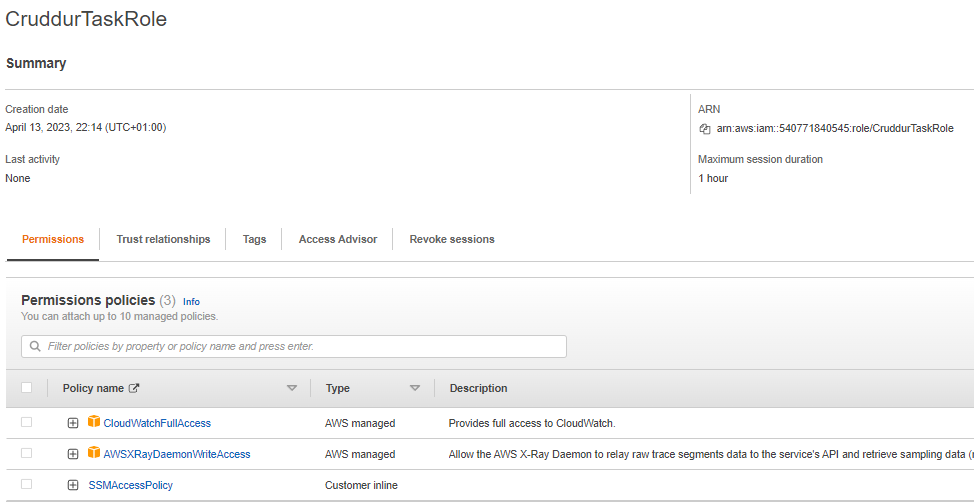

# Week 6 — Deploying Containers


### The Defaults for Env Vars from AB ##

This is reference.  Used occasionally during the work.

A useful way to grab the default VPC ID

```sh
export DEFAULT_VPC_ID=$(aws ec2 describe-vpcs \
--filters "Name=isDefault, Values=true" \
--query "Vpcs[0].VpcId" \
--output text)
echo $DEFAULT_VPC_ID
```

It doesn't seem that I have a default VPC in us-east-1...  So, a hack until I investigate further:

```sh
export DEFAULT_VPC_ID=vpc-0fb11da1fc45e60a8
```

This allows the next part to work:

```sh
export DEFAULT_SUBNET_IDS=$(aws ec2 describe-subnets  \
 --filters Name=vpc-id,Values=$DEFAULT_VPC_ID \
 --query 'Subnets[*].SubnetId' \
 --output json | jq -r 'join(",")')
echo $DEFAULT_SUBNET_IDS
```


## RDS Test Script ##

First thing to do is to create the RDS test script and get that working. It uses Python and gets the OS Env variable for our PSQL DB and then simply tries to connect.  As explained by Andrew, this allows us to test from the container without having to install PSQL client.

```python
#!/usr/bin/env python3

import psycopg
import os
import sys

connection_url = os.getenv("PROD_CONNECTION_URL")

conn = None
try:
  print('attempting connection')
  conn = psycopg.connect(connection_url)
  print("Connection successful!")
except psycopg.Error as e:
  print("Unable to connect to the database:", e)
finally:
  conn.close()
```

This worked straight away.

```sh
gitpod /workspace/aws-bootcamp-cruddur-2023/backend-flask/bin/db (main) $ ./test 
attempting connection
Connection successful!
```

## Health Check ##

We need a health check built into the app to allow our load balancers and/or other entities to check that our application is up/available.

This gets added at the end of the `app.py`

```python
@app.route('/api/health-check')
def health_check():
  return {'success': True}, 200
```

Also, a new script in `bin/flask` to call the health-check using Python, again for security considerations it is better to use python rather than install tools such as `curl`.  I created this in the basic form first, as per the video, but then changed it to include the try/catch from AB's recomendation.

```python
#!/usr/bin/env python3

import urllib.request

try:
  response = urllib.request.urlopen('http://localhost:4567/api/health-check')
  if response.getcode() == 200:
    print("[OK] Flask server is running")
    exit(0) # success
  else:
    print("[BAD] Flask server is not running")
    exit(1) # false
except Exception as e:
  print(e)
  exit(1) # false
```
This worked first time, and you can test by running it:

```sh
gitpod /workspace/aws-bootcamp-cruddur-2023/backend-flask/bin/flask (main) $ ./health-check 
Flask server is running
gitpod /workspace/aws-bootcamp-cruddur-2023/backend-flask/bin/flask (main) $ echo $?
0
```

## CloudWatch Group ##

Create the cloudwatch group :

```sh
aws logs create-log-group --log-group-name cruddur
aws logs put-retention-policy --log-group-name cruddur --retention-in-days 1
```

## Create Cluster ##

Using the AWS, now create the cluster.

``sh
aws ecs create-cluster \
--cluster-name cruddur \
--service-connect-defaults namespace=cruddur
```

This worked (although I needed to retry once);

```sh
gitpod /workspace/aws-bootcamp-cruddur-2023/backend-flask/bin/flask (main) $ aws ecs create-cluster --cluster-name cruddur --service-connect-defaults namespace=cruddur
{
    "cluster": {
        "clusterArn": "arn:aws:ecs:us-east-1:540771840545:cluster/cruddur",
        "clusterName": "cruddur",
        "status": "PROVISIONING",
...
```

Now, in the console you should have an ECS cluster and a generated namespace shown in the ECS console. The namespace also appears in the AWS console under `AWS Cloud Map`, so go and take a look there too.

SKIPPED THESE, but left them for reference:

```sh
export CRUD_CLUSTER_SG=$(aws ec2 create-security-group \
  --group-name cruddur-ecs-cluster-sg \
  --description "Security group for Cruddur ECS ECS cluster" \
  --vpc-id $DEFAULT_VPC_ID \
  --query "GroupId" --output text)
echo $CRUD_CLUSTER_SG
```

```sh
export CRUD_CLUSTER_SG=$(aws ec2 describe-security-groups \
--group-names cruddur-ecs-cluster-sg \
--query 'SecurityGroups[0].GroupId' \
--output text)
```


# Working with ECS Fargate #

##  Create new ECRs for our containers ##

There will be three repos to create.  
 - One for base-image python
 - One for Flask
 - One for React

### Base Image Python ECR ##

Remember direct from Docker Hub was `FROM python:3.10-slim-buster`.  We will host our own in our own ECR, removing reliance on Docker Hub.

So,  create the repo:

```sh
aws ecr create-repository \
  --repository-name cruddur-python \
  --image-tag-mutability MUTABLE
```

This should look like this:

```sh
$ aws ecr create-repository \
  --repository-name cruddur-python \
  --image-tag-mutability MUTABLE
{
    "repository": {
        "repositoryArn": "arn:aws:ecr:us-east-1:540771840545:repository/cruddur-python",
        "registryId": "540771840545",
        "repositoryName": "cruddur-python",
        "repositoryUri": "540771840545.dkr.ecr.us-east-1.amazonaws.com/cruddur-python",
        "createdAt": "2023-04-13T06:44:04+00:00",
        "imageTagMutability": "MUTABLE",
        "imageScanningConfiguration": {
            "scanOnPush": false
        },
        "encryptionConfiguration": {
            "encryptionType": "AES256"
        }
    }
}
```
You can now see the new repository in the AWS Console under ECS / ECR.  You can use the console to take a look at the push/pull ECR commands.

Now, grab the URL as an OS Env Var.

```sh
export ECR_PYTHON_URL="$AWS_ACCOUNT_ID.dkr.ecr.$AWS_DEFAULT_REGION.amazonaws.com/cruddur-python"
echo $ECR_PYTHON_URL
```

Now we can login to ECR which is a requirement (of course) for us to be able to push/pull containers:

```sh
aws ecr get-login-password --region $AWS_DEFAULT_REGION |  docker login --username AWS --password-stdin "$AWS_ACCOUNT_ID.dkr.ecr.$AWS_DEFAULT_REGION.amazonaws.com"
```
Be aware that your unencrypted password is stored locally :  `WARNING! Your password will be stored unencrypted in /home/gitpod/.docker/config.json.`

Now Pull the base python down (it isn't our own, so we pull it from DH)

```sh
docker pull python:3.10-slim-buster
```

Then tag it:

```sh
 docker tag python:3.10-slim-buster $ECR_PYTHON_URL:3.10-slim-buster
```

And push it up to our ECR:

```sh

$ docker push $ECR_PYTHON_URL:3.10-slim-buster
The push refers to repository [540771840545.dkr.ecr.us-east-1.amazonaws.com/cruddur-python]
7f2fe4cb548a: Pushed 
c7787300a586: Pushed 
039e9922562b: Pushed 
ccc60df26c61: Pushed 
61a5c84a1270: Pushed 
3.10-slim-buster: digest: sha256:7857e9a198fc4b06818b0e064c13b21485b72c7fdb1f51d3b13c9854ca2fcfa5 size: 1370
gitpod /workspace/aws-bootcamp-cruddur-2023/backend-flask/bin/flask (main) $ 

```

You will now see the image in the ECR in AWS Console, go and check.


### Base Image Python ECR ##

Now we need to push an image of our Flash app up to ECR.

First we need to edit the Dockerfile and replace the DH reference to slim-buster with our own ECR-stored copy.  This means our Flask app will now use our ECR-stored slim-buster container.
 
The top of the DockerFile in `backend-flask` needs this as the top line:

```DockerFile
FROM 540771840545.dkr.ecr.us-east-1.amazonaws.com/cruddur-python:3.10-slim-buster

WORKDIR /backend-flask
```

Of course it will vary. It is the repository URI from either the AWS console or get it from our Env Var, PLUS the image name

```sh
$ echo $ECR_PYTHON_URL
540771840545.dkr.ecr.us-east-1.amazonaws.com/cruddur-python
```

It is also possible to get the repo URI using:

```sh
aws ecr describe-repositories --repository-name cruddur-python --query 'repositories[0].repositoryUri'
```


Next, create the Flask Repo:

```sh
aws ecr create-repository \
  --repository-name backend-flask \
  --image-tag-mutability MUTABLE
```

Output should look like this:

```sh
$ aws ecr create-repository \
  --repository-name backend-flask \
  --image-tag-mutability MUTABLE
{
    "repository": {
        "repositoryArn": "arn:aws:ecr:us-east-1:540771840545:repository/backend-flask",
        "registryId": "540771840545",
        "repositoryName": "backend-flask",
        "repositoryUri": "540771840545.dkr.ecr.us-east-1.amazonaws.com/backend-flask",
        "createdAt": "2023-04-13T20:03:36+00:00",
        "imageTagMutability": "MUTABLE",
        "imageScanningConfiguration": {
            "scanOnPush": false
        },
        "encryptionConfiguration": {
            "encryptionType": "AES256"
        }
    }
}
```

Next set an env var for the URL to reach this new repo.

```sh
export ECR_BACKEND_FLASK_URL="$AWS_ACCOUNT_ID.dkr.ecr.$AWS_DEFAULT_REGION.amazonaws.com/backend-flask"
echo $ECR_BACKEND_FLASK_URL
```

Now, build the image.  This is our own, not one that we pulled from DH, as in the previous example for Python slim.  

```sh
cd /workspace/aws-bootcamp-cruddur-2023/backend-flask
docker build -t backend-flask .
```

This should build and you'll see the pull from the ECR for the base layer (python:3.10-slim-buster):

```sh
$ docker build -t backend-flask .
DEPRECATED: The legacy builder is deprecated and will be removed in a future release.
            Install the buildx component to build images with BuildKit:
            https://docs.docker.com/go/buildx/

Sending build context to Docker daemon  134.1kB
Step 1/8 : FROM 540771840545.dkr.ecr.us-east-1.amazonaws.com/cruddur-python:3.10-slim-buster
3.10-slim-buster: Pulling from cruddur-python
9fbefa337077: Pull complete 
a25702e0699e: Pull complete 
...
```

Next, tag the image:

```sh
docker tag backend-flask:latest $ECR_BACKEND_FLASK_URL:latest
```

Push the image up to the repo.

```sh
docker push $ECR_BACKEND_FLASK_URL:latest
```

This should push successfully, you can check in the console:




## Create System Manager Parameter Store ##

We need AWS SSM Parameter store to store our various variables and secrets.  For this, you need to make sure you have all of the following set as environment variables in your shell.  These will come from your current `docker-compose.yml` file (stored in your env from gp env)

      PROD_CONNECTION_URL: "${PROD_CONNECTION_URL}"
      OTEL_EXPORTER_OTLP_HEADERS: "x-honeycomb-team=${HONEYCOMB_API_KEY}"
      AWS_ACCESS_KEY_ID: "${AWS_ACCESS_KEY_ID}"
      AWS_SECRET_ACCESS_KEY: "${AWS_SECRET_ACCESS_KEY}"
      ROLLBAR_ACCESS_TOKEN: "${ROLLBAR_ACCESS_TOKEN}"

Also

      HONEYCOMB_API_KEY

Then set them as follows:

```sh
aws ssm put-parameter --type "SecureString" --name "/cruddur/backend-flask/AWS_ACCESS_KEY_ID" --value $AWS_ACCESS_KEY_ID
aws ssm put-parameter --type "SecureString" --name "/cruddur/backend-flask/AWS_SECRET_ACCESS_KEY" --value $AWS_SECRET_ACCESS_KEY
aws ssm put-parameter --type "SecureString" --name "/cruddur/backend-flask/CONNECTION_URL" --value $PROD_CONNECTION_URL
aws ssm put-parameter --type "SecureString" --name "/cruddur/backend-flask/ROLLBAR_ACCESS_TOKEN" --value $ROLLBAR_ACCESS_TOKEN
aws ssm put-parameter --type "SecureString" --name "/cruddur/backend-flask/OTEL_EXPORTER_OTLP_HEADERS" --value "x-honeycomb-team=$HONEYCOMB_API_KEY"
```

Investigate your parameters in the console under systems manager -> parameter store.


## Create Task and Execution Roles for Task Definition ##

### Create Execution Role ###

Create a new policy file under `aws/policies` to hold the policy definition (call it `service-execution-policy.json`):

```json
{
    "Version":"2012-10-17",
    "Statement":[{
        "Action":["sts:AssumeRole"],
        "Effect":"Allow",
        "Principal":{
          "Service":["ecs-tasks.amazonaws.com"]
      }}]
  }
```

This can then be used with aws cli `create-role`

```sh
aws iam create-role --role-name CruddurServiceExecutionRole --assume-role-policy-document file://aws/policies/service-assume-role-execution-policy.json
```

Output should be:


```sh
$ aws iam create-role --role-name CruddurServiceExecutionRole --assume-role-policy-document file://aws/policies/service-assume-role-execution-policy.json
{
    "Role": {
        "Path": "/",
        "RoleName": "CruddurServiceExecutionRole",
        "RoleId": "AROAX32EDOIQ2WTHZEZ6R",
        "Arn": "arn:aws:iam::540771840545:role/CruddurServiceExecutionRole",
        "CreateDate": "2023-04-13T21:03:28+00:00",
        "AssumeRolePolicyDocument": {
            "Version": "2012-10-17",
            "Statement": [
                {
                    "Action": [
                        "sts:AssumeRole"
                    ],
                    "Effect": "Allow",
                    "Principal": {
                        "Service": [
                            "ecs-tasks.amazonaws.com"
                        ]
                    }
                }
            ]
        }
    }
}
```

Then you need another file for the service execution policy under aws:

```json
{
  "Version":"2012-10-17",
  "Statement":[{
        "Effect": "Allow",
        "Action": [
          "ssm:GetParameters",
          "ssm:GetParameter"
        ],
        "Resource": "arn:aws:ssm:us-east-1:540771840545:parameter/cruddur/backend-flask/*"
    }]
}
```

Then run:

```sh
aws iam put-role-policy \
  --policy-name CruddurServiceExecutionPolicy \
  --role-name CruddurServiceExecutionRole \
  --policy-document file://aws/policies/service-execution-policy.json


aws iam attach-role-policy \
    --policy-arn arn:aws:iam::aws:policy/service-role/AmazonECSTaskExecutionRolePolicy \
    --role-name CruddurServiceExecutionRole
```

Check the new role in the AWS console, IAM.




## Create Task Role ##

Do this via the AWS CLI

```sh
aws iam create-role \
    --role-name CruddurTaskRole \
    --assume-role-policy-document "{
  \"Version\":\"2012-10-17\",
  \"Statement\":[{
    \"Action\":[\"sts:AssumeRole\"],
    \"Effect\":\"Allow\",
    \"Principal\":{
      \"Service\":[\"ecs-tasks.amazonaws.com\"]
    }
  }]
}"

aws iam put-role-policy \
  --policy-name SSMAccessPolicy \
  --role-name CruddurTaskRole \
  --policy-document "{
  \"Version\":\"2012-10-17\",
  \"Statement\":[{
    \"Action\":[
      \"ssmmessages:CreateControlChannel\",
      \"ssmmessages:CreateDataChannel\",
      \"ssmmessages:OpenControlChannel\",
      \"ssmmessages:OpenDataChannel\"
    ],
    \"Effect\":\"Allow\",
    \"Resource\":\"*\"
  }]
}
"

aws iam attach-role-policy --policy-arn arn:aws:iam::aws:policy/CloudWatchFullAccess --role-name CruddurTaskRole
aws iam attach-role-policy --policy-arn arn:aws:iam::aws:policy/AWSXRayDaemonWriteAccess --role-name CruddurTaskRole
```

Check this in the AWS Console





## Register Task Definition ##

With local Docker, you use docker-compose.yml, but with ECS we must use a task definition file.  Create a new folder `aws\task-definitions` and create a file within called `backend-flask.json`

Here's the contents:

```json
{
    "family": "backend-flask",
    "executionRoleArn": "arn:aws:iam::540771840545:role/CruddurServiceExecutionRole",
    "taskRoleArn": "arn:aws:iam::540771840545:role/CruddurTaskRole",
    "networkMode": "awsvpc",
    "cpu": "256",
    "memory": "512",
    "requiresCompatibilities": [ 
      "FARGATE" 
    ],
    "containerDefinitions": [
      {
        "name": "backend-flask",
        "image": "540771840545.dkr.ecr.us-east-1.amazonaws.com/backend-flask",
        "essential": true,
        "healthCheck": {
          "command": [
            "CMD-SHELL",
            "python /backend-flask/bin/flask/health-check"
          ],
          "interval": 30,
          "timeout": 5,
          "retries": 3,
          "startPeriod": 60
        },
        "portMappings": [
          {
            "name": "backend-flask",
            "containerPort": 4567,
            "protocol": "tcp", 
            "appProtocol": "http"
          }
        ],
        "logConfiguration": {
          "logDriver": "awslogs",
          "options": {
              "awslogs-group": "cruddur",
              "awslogs-region": "us-east-1",
              "awslogs-stream-prefix": "backend-flask"
          }
        },
        "environment": [
          {"name": "OTEL_SERVICE_NAME", "value": "backend-flask"},
          {"name": "OTEL_EXPORTER_OTLP_ENDPOINT", "value": "https://api.honeycomb.io"},
          {"name": "AWS_COGNITO_USER_POOL_ID", "value": "us-east-1_dh0ExXiP1"},
          {"name": "AWS_COGNITO_USER_POOL_CLIENT_ID", "value": "63q2l315cgptsl5mrauqbvab7a"},
          {"name": "FRONTEND_URL", "value": "*"},
          {"name": "BACKEND_URL", "value": "*"},
          {"name": "AWS_DEFAULT_REGION", "value": "us-east-1"}
        ],
        "secrets": [
          {"name": "AWS_ACCESS_KEY_ID"    , "valueFrom": "arn:aws:ssm:us-east-1:540771840545:parameter/cruddur/backend-flask/AWS_ACCESS_KEY_ID"},
          {"name": "AWS_SECRET_ACCESS_KEY", "valueFrom": "arn:aws:ssm:us-east-1:540771840545:parameter/cruddur/backend-flask/AWS_SECRET_ACCESS_KEY"},
          {"name": "CONNECTION_URL"       , "valueFrom": "arn:aws:ssm:us-east-1:540771840545:parameter/cruddur/backend-flask/CONNECTION_URL" },
          {"name": "ROLLBAR_ACCESS_TOKEN" , "valueFrom": "arn:aws:ssm:us-east-1:540771840545:parameter/cruddur/backend-flask/ROLLBAR_ACCESS_TOKEN" },
          {"name": "OTEL_EXPORTER_OTLP_HEADERS" , "valueFrom": "arn:aws:ssm:us-east-1:540771840545:parameter/cruddur/backend-flask/OTEL_EXPORTER_OTLP_HEADERS" }
        ]
      }
    ]
  }
  ```
Then run this to create the task definition for the backend flask:

```sh
aws ecs register-task-definition --cli-input-json file://aws/task-definitions/backend-flask.json
```
You will be returned JSON, it is large, I've stored it in `aws\outputs` but it starts:

```json
{
    "taskDefinition": {
        "taskDefinitionArn": "arn:aws:ecs:us-east-1:540771840545:task-definition/backend-flask:1",
        "containerDefinitions": [
...
```

Check it in the AWS console, under ECS, Task Definitions.

## Create Security Group ##

This requires the DEFAULT_VPC_ID env var to be set - see the very top of this file.

```sh
export CRUD_SERVICE_SG=$(aws ec2 create-security-group \
  --group-name "crud-srv-sg" \
  --description "Security group for Cruddur services on ECS" \
  --vpc-id $DEFAULT_VPC_ID \
  --query "GroupId" --output text)
echo $CRUD_SERVICE_SG
```

With that SG created, authorize it.

```sh
aws ec2 authorize-security-group-ingress \
  --group-id $CRUD_SERVICE_SG \
  --protocol tcp \
  --port 80 \
  --cidr 0.0.0.0/0
```


## Create Service test for ECS in console... ##

Now under ECS, Cluster, create service, you WILL be able to select a task definition family.  It should show `backend-flask`.

Select the SG Created in the previous step (see $CRUD_SERVICE_SG)

