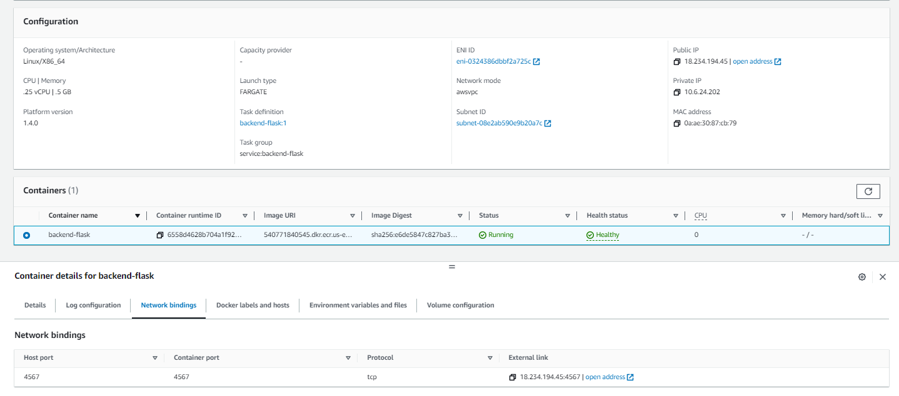
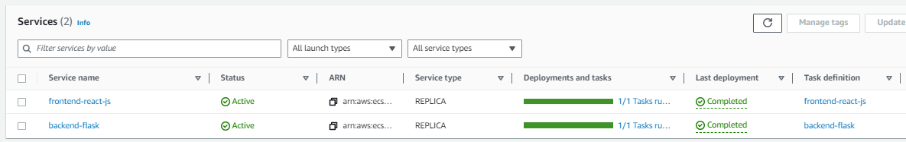
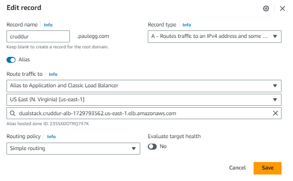
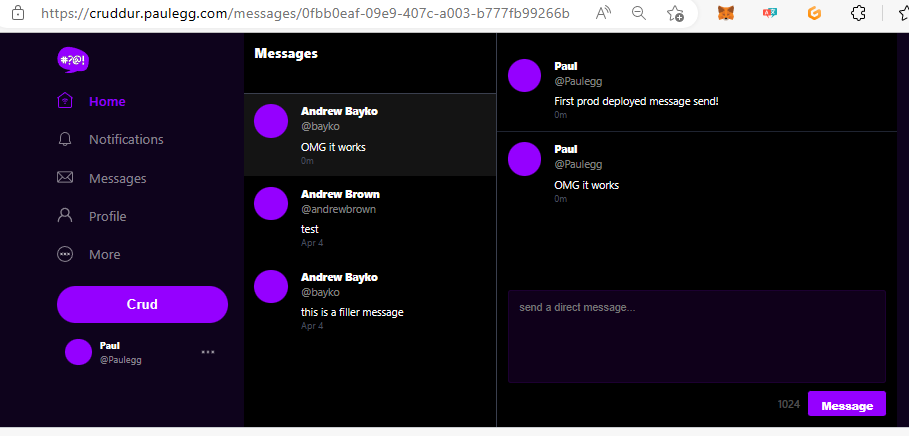

# Week 6 — Deploying Containers


### The Defaults for Env Vars from AB ##

This is reference.  Used occasionally during the work.

A useful way to grab the default VPC ID

```sh
export DEFAULT_VPC_ID=$(aws ec2 describe-vpcs \
--filters "Name=isDefault, Values=true" \
--query "Vpcs[0].VpcId" \
--output text)
echo $DEFAULT_VPC_ID
```

It doesn't seem that I have a default VPC in us-east-1...  So, a hack until I investigate further:

```sh
export DEFAULT_VPC_ID=vpc-0fb11da1fc45e60a8
```

This allows the next part to work:

```sh
export DEFAULT_SUBNET_IDS=$(aws ec2 describe-subnets  \
 --filters Name=vpc-id,Values=$DEFAULT_VPC_ID \
 --query 'Subnets[*].SubnetId' \
 --output json | jq -r 'join(",")')
echo $DEFAULT_SUBNET_IDS
```


## RDS Test Script ##

First thing to do is to create the RDS test script and get that working. It uses Python and gets the OS Env variable for our PSQL DB and then simply tries to connect.  As explained by Andrew, this allows us to test from the container without having to install PSQL client.

```python
#!/usr/bin/env python3

import psycopg
import os
import sys

connection_url = os.getenv("PROD_CONNECTION_URL")

conn = None
try:
  print('attempting connection')
  conn = psycopg.connect(connection_url)
  print("Connection successful!")
except psycopg.Error as e:
  print("Unable to connect to the database:", e)
finally:
  conn.close()
```

This worked straight away.

```sh
gitpod /workspace/aws-bootcamp-cruddur-2023/backend-flask/bin/db (main) $ ./test 
attempting connection
Connection successful!
```

## Health Check ##

We need a health check built into the app to allow our load balancers and/or other entities to check that our application is up/available.

This gets added at the end of the `app.py`

```python
@app.route('/api/health-check')
def health_check():
  return {'success': True}, 200
```

Also, a new script in `bin/flask` to call the health-check using Python, again for security considerations it is better to use python rather than install tools such as `curl`.  I created this in the basic form first, as per the video, but then changed it to include the try/catch from AB's recomendation.

```python
#!/usr/bin/env python3

import urllib.request

try:
  response = urllib.request.urlopen('http://localhost:4567/api/health-check')
  if response.getcode() == 200:
    print("[OK] Flask server is running")
    exit(0) # success
  else:
    print("[BAD] Flask server is not running")
    exit(1) # false
except Exception as e:
  print(e)
  exit(1) # false
```
This worked first time, and you can test by running it:

```sh
gitpod /workspace/aws-bootcamp-cruddur-2023/backend-flask/bin/flask (main) $ ./health-check 
Flask server is running
gitpod /workspace/aws-bootcamp-cruddur-2023/backend-flask/bin/flask (main) $ echo $?
0
```

## CloudWatch Group ##

Create the cloudwatch group :

```sh
aws logs create-log-group --log-group-name cruddur
aws logs put-retention-policy --log-group-name cruddur --retention-in-days 1
```

## Create Cluster ##

Using the AWS, now create the cluster.

``sh
aws ecs create-cluster \
--cluster-name cruddur \
--service-connect-defaults namespace=cruddur
```

This worked (although I needed to retry once);

```sh
gitpod /workspace/aws-bootcamp-cruddur-2023/backend-flask/bin/flask (main) $ aws ecs create-cluster --cluster-name cruddur --service-connect-defaults namespace=cruddur
{
    "cluster": {
        "clusterArn": "arn:aws:ecs:us-east-1:540771840545:cluster/cruddur",
        "clusterName": "cruddur",
        "status": "PROVISIONING",
...
```

Now, in the console you should have an ECS cluster and a generated namespace shown in the ECS console. The namespace also appears in the AWS console under `AWS Cloud Map`, so go and take a look there too.

SKIPPED THESE, but left them for reference:

```sh
export CRUD_CLUSTER_SG=$(aws ec2 create-security-group \
  --group-name cruddur-ecs-cluster-sg \
  --description "Security group for Cruddur ECS ECS cluster" \
  --vpc-id $DEFAULT_VPC_ID \
  --query "GroupId" --output text)
echo $CRUD_CLUSTER_SG
```

```sh
export CRUD_CLUSTER_SG=$(aws ec2 describe-security-groups \
--filters Name=vpc-id,Values=$DEFAULT_VPC_ID \
--query 'SecurityGroups[0].GroupId' \
--output text)
```


# Working with ECS Fargate #

##  Create new ECRs for our containers ##

There will be three repos to create.  
 - One for base-image python
 - One for Flask
 - One for React

### Base Image Python ECR ##

Remember direct from Docker Hub was `FROM python:3.10-slim-buster`.  We will host our own in our own ECR, removing reliance on Docker Hub.

So,  create the repo:

```sh
aws ecr create-repository \
  --repository-name cruddur-python \
  --image-tag-mutability MUTABLE
```

This should look like this:

```sh
$ aws ecr create-repository \
  --repository-name cruddur-python \
  --image-tag-mutability MUTABLE
{
    "repository": {
        "repositoryArn": "arn:aws:ecr:us-east-1:540771840545:repository/cruddur-python",
        "registryId": "540771840545",
        "repositoryName": "cruddur-python",
        "repositoryUri": "540771840545.dkr.ecr.us-east-1.amazonaws.com/cruddur-python",
        "createdAt": "2023-04-13T06:44:04+00:00",
        "imageTagMutability": "MUTABLE",
        "imageScanningConfiguration": {
            "scanOnPush": false
        },
        "encryptionConfiguration": {
            "encryptionType": "AES256"
        }
    }
}
```
You can now see the new repository in the AWS Console under ECS / ECR.  You can use the console to take a look at the push/pull ECR commands.

Now, grab the URL as an OS Env Var.

```sh
export ECR_PYTHON_URL="$AWS_ACCOUNT_ID.dkr.ecr.$AWS_DEFAULT_REGION.amazonaws.com/cruddur-python"
echo $ECR_PYTHON_URL
```

Now we can login to ECR which is a requirement (of course) for us to be able to push/pull containers:

```sh
aws ecr get-login-password --region $AWS_DEFAULT_REGION |  docker login --username AWS --password-stdin "$AWS_ACCOUNT_ID.dkr.ecr.$AWS_DEFAULT_REGION.amazonaws.com"
```
Be aware that your unencrypted password is stored locally :  `WARNING! Your password will be stored unencrypted in /home/gitpod/.docker/config.json.`

Now Pull the base python down (it isn't our own, so we pull it from DH)

```sh
docker pull python:3.10-slim-buster
```

Then tag it:

```sh
 docker tag python:3.10-slim-buster $ECR_PYTHON_URL:3.10-slim-buster
```

And push it up to our ECR:

```sh

$ docker push $ECR_PYTHON_URL:3.10-slim-buster
The push refers to repository [540771840545.dkr.ecr.us-east-1.amazonaws.com/cruddur-python]
7f2fe4cb548a: Pushed 
c7787300a586: Pushed 
039e9922562b: Pushed 
ccc60df26c61: Pushed 
61a5c84a1270: Pushed 
3.10-slim-buster: digest: sha256:7857e9a198fc4b06818b0e064c13b21485b72c7fdb1f51d3b13c9854ca2fcfa5 size: 1370
gitpod /workspace/aws-bootcamp-cruddur-2023/backend-flask/bin/flask (main) $ 

```

You will now see the image in the ECR in AWS Console, go and check.


### Base Image Python ECR ##

Now we need to push an image of our Flash app up to ECR.

First we need to edit the Dockerfile and replace the DH reference to slim-buster with our own ECR-stored copy.  This means our Flask app will now use our ECR-stored slim-buster container.
 
The top of the DockerFile in `backend-flask` needs this as the top line:

```DockerFile
FROM 540771840545.dkr.ecr.us-east-1.amazonaws.com/cruddur-python:3.10-slim-buster

WORKDIR /backend-flask
```

Of course it will vary. It is the repository URI from either the AWS console or get it from our Env Var, PLUS the image name

```sh
$ echo $ECR_PYTHON_URL
540771840545.dkr.ecr.us-east-1.amazonaws.com/cruddur-python
```

It is also possible to get the repo URI using:

```sh
aws ecr describe-repositories --repository-name cruddur-python --query 'repositories[0].repositoryUri'
```


Next, create the Flask Repo:

```sh
aws ecr create-repository \
  --repository-name backend-flask \
  --image-tag-mutability MUTABLE
```

Output should look like this:

```sh
$ aws ecr create-repository \
  --repository-name backend-flask \
  --image-tag-mutability MUTABLE
{
    "repository": {
        "repositoryArn": "arn:aws:ecr:us-east-1:540771840545:repository/backend-flask",
        "registryId": "540771840545",
        "repositoryName": "backend-flask",
        "repositoryUri": "540771840545.dkr.ecr.us-east-1.amazonaws.com/backend-flask",
        "createdAt": "2023-04-13T20:03:36+00:00",
        "imageTagMutability": "MUTABLE",
        "imageScanningConfiguration": {
            "scanOnPush": false
        },
        "encryptionConfiguration": {
            "encryptionType": "AES256"
        }
    }
}
```

Next set an env var for the URL to reach this new repo.

```sh
export ECR_BACKEND_FLASK_URL="$AWS_ACCOUNT_ID.dkr.ecr.$AWS_DEFAULT_REGION.amazonaws.com/backend-flask"
echo $ECR_BACKEND_FLASK_URL
```

Now, build the image.  This is our own, not one that we pulled from DH, as in the previous example for Python slim.  

```sh
cd /workspace/aws-bootcamp-cruddur-2023/backend-flask
docker build -t backend-flask .
```

This should build and you'll see the pull from the ECR for the base layer (python:3.10-slim-buster):

```sh
$ docker build -t backend-flask .
DEPRECATED: The legacy builder is deprecated and will be removed in a future release.
            Install the buildx component to build images with BuildKit:
            https://docs.docker.com/go/buildx/

Sending build context to Docker daemon  134.1kB
Step 1/8 : FROM 540771840545.dkr.ecr.us-east-1.amazonaws.com/cruddur-python:3.10-slim-buster
3.10-slim-buster: Pulling from cruddur-python
9fbefa337077: Pull complete 
a25702e0699e: Pull complete 
...
```

Next, tag the image:

```sh
docker tag backend-flask:latest $ECR_BACKEND_FLASK_URL:latest
```

Push the image up to the repo.

```sh
docker push $ECR_BACKEND_FLASK_URL:latest
```

This should push successfully, you can check in the console:


## Create System Manager Parameter Store ##

We need AWS SSM Parameter store to store our various variables and secrets.  For this, you need to make sure you have all of the following set as environment variables in your shell.  These will come from your current `docker-compose.yml` file (stored in your env from gp env)

      PROD_CONNECTION_URL: "${PROD_CONNECTION_URL}"
      OTEL_EXPORTER_OTLP_HEADERS: "x-honeycomb-team=${HONEYCOMB_API_KEY}"
      AWS_ACCESS_KEY_ID: "${AWS_ACCESS_KEY_ID}"
      AWS_SECRET_ACCESS_KEY: "${AWS_SECRET_ACCESS_KEY}"
      ROLLBAR_ACCESS_TOKEN: "${ROLLBAR_ACCESS_TOKEN}"

Also

      HONEYCOMB_API_KEY

Then set them as follows:

```sh
aws ssm put-parameter --type "SecureString" --name "/cruddur/backend-flask/AWS_ACCESS_KEY_ID" --value $AWS_ACCESS_KEY_ID
aws ssm put-parameter --type "SecureString" --name "/cruddur/backend-flask/AWS_SECRET_ACCESS_KEY" --value $AWS_SECRET_ACCESS_KEY
aws ssm put-parameter --type "SecureString" --name "/cruddur/backend-flask/CONNECTION_URL" --value $PROD_CONNECTION_URL
aws ssm put-parameter --type "SecureString" --name "/cruddur/backend-flask/ROLLBAR_ACCESS_TOKEN" --value $ROLLBAR_ACCESS_TOKEN
aws ssm put-parameter --type "SecureString" --name "/cruddur/backend-flask/OTEL_EXPORTER_OTLP_HEADERS" --value "x-honeycomb-team=$HONEYCOMB_API_KEY"
```

Investigate your parameters in the console under systems manager -> parameter store.


## Create Task and Execution Roles for Task Definition ##

### Create Execution Role ###

Create a new policy file under `aws/policies` to hold the policy definition (call it `service-execution-policy.json`):

```json
{
    "Version":"2012-10-17",
    "Statement":[{
        "Action":["sts:AssumeRole"],
        "Effect":"Allow",
        "Principal":{
          "Service":["ecs-tasks.amazonaws.com"]
      }}]
  }
```

This can then be used with aws cli `create-role`

```sh
aws iam create-role --role-name CruddurServiceExecutionRole --assume-role-policy-document file://aws/policies/service-assume-role-execution-policy.json
```

Output should be:


```sh
$ aws iam create-role --role-name CruddurServiceExecutionRole --assume-role-policy-document file://aws/policies/service-assume-role-execution-policy.json
{
    "Role": {
        "Path": "/",
        "RoleName": "CruddurServiceExecutionRole",
        "RoleId": "AROAX32EDOIQ2WTHZEZ6R",
        "Arn": "arn:aws:iam::540771840545:role/CruddurServiceExecutionRole",
        "CreateDate": "2023-04-13T21:03:28+00:00",
        "AssumeRolePolicyDocument": {
            "Version": "2012-10-17",
            "Statement": [
                {
                    "Action": [
                        "sts:AssumeRole"
                    ],
                    "Effect": "Allow",
                    "Principal": {
                        "Service": [
                            "ecs-tasks.amazonaws.com"
                        ]
                    }
                }
            ]
        }
    }
}
```

Then you need another file for the service execution policy under aws:

```json
{
  "Version":"2012-10-17",
  "Statement":[{
        "Effect": "Allow",
        "Action": [
          "ssm:GetParameters",
          "ssm:GetParameter"
        ],
        "Resource": "arn:aws:ssm:us-east-1:540771840545:parameter/cruddur/backend-flask/*"
    }]
}
```

Then run:

```sh
aws iam put-role-policy \
  --policy-name CruddurServiceExecutionPolicy \
  --role-name CruddurServiceExecutionRole \
  --policy-document file://aws/policies/service-execution-policy.json


aws iam attach-role-policy \
    --policy-arn arn:aws:iam::aws:policy/service-role/AmazonECSTaskExecutionRolePolicy \
    --role-name CruddurServiceExecutionRole
```

Check the new role in the AWS console, IAM.


## Create Task Role ##

Do this via the AWS CLI

```sh
aws iam create-role \
    --role-name CruddurTaskRole \
    --assume-role-policy-document "{
  \"Version\":\"2012-10-17\",
  \"Statement\":[{
    \"Action\":[\"sts:AssumeRole\"],
    \"Effect\":\"Allow\",
    \"Principal\":{
      \"Service\":[\"ecs-tasks.amazonaws.com\"]
    }
  }]
}"

aws iam put-role-policy \
  --policy-name SSMAccessPolicy \
  --role-name CruddurTaskRole \
  --policy-document "{
  \"Version\":\"2012-10-17\",
  \"Statement\":[{
    \"Action\":[
      \"ssmmessages:CreateControlChannel\",
      \"ssmmessages:CreateDataChannel\",
      \"ssmmessages:OpenControlChannel\",
      \"ssmmessages:OpenDataChannel\"
    ],
    \"Effect\":\"Allow\",
    \"Resource\":\"*\"
  }]
}
"

aws iam attach-role-policy --policy-arn arn:aws:iam::aws:policy/CloudWatchFullAccess --role-name CruddurTaskRole
aws iam attach-role-policy --policy-arn arn:aws:iam::aws:policy/AWSXRayDaemonWriteAccess --role-name CruddurTaskRole
```

Check this in the AWS Console


## Register Task Definition ##

With local Docker, you use docker-compose.yml, but with ECS we must use a task definition file.  Create a new folder `aws\task-definitions` and create a file within called `backend-flask.json`

Here's the contents:

```json
{
    "family": "backend-flask",
    "executionRoleArn": "arn:aws:iam::540771840545:role/CruddurServiceExecutionRole",
    "taskRoleArn": "arn:aws:iam::540771840545:role/CruddurTaskRole",
    "networkMode": "awsvpc",
    "cpu": "256",
    "memory": "512",
    "requiresCompatibilities": [ 
      "FARGATE" 
    ],
    "containerDefinitions": [
      {
        "name": "backend-flask",
        "image": "540771840545.dkr.ecr.us-east-1.amazonaws.com/backend-flask",
        "essential": true,
        "healthCheck": {
          "command": [
            "CMD-SHELL",
            "python /backend-flask/bin/flask/health-check"
          ],
          "interval": 30,
          "timeout": 5,
          "retries": 3,
          "startPeriod": 60
        },
        "portMappings": [
          {
            "name": "backend-flask",
            "containerPort": 4567,
            "protocol": "tcp", 
            "appProtocol": "http"
          }
        ],
        "logConfiguration": {
          "logDriver": "awslogs",
          "options": {
              "awslogs-group": "cruddur",
              "awslogs-region": "us-east-1",
              "awslogs-stream-prefix": "backend-flask"
          }
        },
        "environment": [
          {"name": "OTEL_SERVICE_NAME", "value": "backend-flask"},
          {"name": "OTEL_EXPORTER_OTLP_ENDPOINT", "value": "https://api.honeycomb.io"},
          {"name": "AWS_COGNITO_USER_POOL_ID", "value": "us-east-1_dh0ExXiP1"},
          {"name": "AWS_COGNITO_USER_POOL_CLIENT_ID", "value": "63q2l315cgptsl5mrauqbvab7a"},
          {"name": "FRONTEND_URL", "value": "*"},
          {"name": "BACKEND_URL", "value": "*"},
          {"name": "AWS_DEFAULT_REGION", "value": "us-east-1"}
        ],
        "secrets": [
          {"name": "AWS_ACCESS_KEY_ID"    , "valueFrom": "arn:aws:ssm:us-east-1:540771840545:parameter/cruddur/backend-flask/AWS_ACCESS_KEY_ID"},
          {"name": "AWS_SECRET_ACCESS_KEY", "valueFrom": "arn:aws:ssm:us-east-1:540771840545:parameter/cruddur/backend-flask/AWS_SECRET_ACCESS_KEY"},
          {"name": "CONNECTION_URL"       , "valueFrom": "arn:aws:ssm:us-east-1:540771840545:parameter/cruddur/backend-flask/CONNECTION_URL" },
          {"name": "ROLLBAR_ACCESS_TOKEN" , "valueFrom": "arn:aws:ssm:us-east-1:540771840545:parameter/cruddur/backend-flask/ROLLBAR_ACCESS_TOKEN" },
          {"name": "OTEL_EXPORTER_OTLP_HEADERS" , "valueFrom": "arn:aws:ssm:us-east-1:540771840545:parameter/cruddur/backend-flask/OTEL_EXPORTER_OTLP_HEADERS" }
        ]
      }
    ]
  }
  ```
Then run this to create the task definition for the backend flask:

```sh
aws ecs register-task-definition --cli-input-json file://aws/task-definitions/backend-flask.json
```
You will be returned JSON, it is large, I've stored it in `aws\outputs` but it starts:

```json
{
    "taskDefinition": {
        "taskDefinitionArn": "arn:aws:ecs:us-east-1:540771840545:task-definition/backend-flask:1",
        "containerDefinitions": [
...
```

Check it in the AWS console, under ECS, Task Definitions.

## Create Security Group ##

This requires the DEFAULT_VPC_ID env var to be set - see the very top of this file.

```sh
export CRUD_SERVICE_SG=$(aws ec2 create-security-group \
  --group-name "crud-srv-sg" \
  --description "Security group for Cruddur services on ECS" \
  --vpc-id $DEFAULT_VPC_ID \
  --query "GroupId" --output text)
echo $CRUD_SERVICE_SG
```

With that SG created, authorize it.

```sh
aws ec2 authorize-security-group-ingress \
  --group-id $CRUD_SERVICE_SG \
  --protocol tcp \
  --port 80 \
  --cidr 0.0.0.0/0
```


## Create Service test for ECS in console... ##

Now under ECS, Cluster, create service, you WILL be able to select a task definition family.  It should show `backend-flask`.

Select the SG Created in the previous step (see $CRUD_SERVICE_SG)

## Launch Cluster in ECS via the Console ##

This worked for me first time :) 

Need to delete and run via command line.  See below.

## Launch service via command line ##

Unfortunately, in order to enable execute-command on the service it needs to be created via the CLI because the options isn't present in the web console.

Create the file `aws/json/service-backend-flask.json` and then run

```sh
aws ecs create-service --cli-input-json file://aws/json/service-backend-flask.json
```

Output is json if successful and looks like this (truncated):

```json
{
    "service": {
        "serviceArn": "arn:aws:ecs:us-east-1:540771840545:service/cruddur/backend-flask",
        "serviceName": "backend-flask",
        "clusterArn": "arn:aws:ecs:us-east-1:540771840545:cluster/cruddur",
        "loadBalancers": [],
        "serviceRegistries": [],
        "status": "ACTIVE",
        "desiredCount": 1,
...
```

The task should have enableExecuteCommand set to true:

```sh
gitpod /workspace/aws-bootcamp-cruddur-2023 (main) $ aws ecs describe-tasks --cluster cruddur --tasks 20b5fce0b0ac44928ab516a5db2cb4a3 |grep enableExec
            "enableExecuteCommand": true,
gitpod /workspace/aws-bootcamp-cruddur-2023 (main) $ 
```

The console should show the service being created.  Go and check!

## The SHELL WORKS ##

Now test the execute-command using the task ID of the new task:

```sh
$ aws ecs execute-command --region $AWS_DEFAULT_REGION --cluster cruddur --task 6558d4628b704a1f92b2582041b2119b --container backend-flask --command "/bin/bash" --interactive

The Session Manager plugin was installed successfully. Use the AWS CLI to start a session.


Starting session with SessionId: ecs-execute-command-0cf7e71dfe57d40e2
root@ip-10-6-24-202:/backend-flask# 
root@ip-10-6-24-202:/backend-flask# 
```
## Add the SSM stuff to gitpod yml for next times ##

```sh
  - name: fargate
    before: |
      curl "https://s3.amazonaws.com/session-manager-downloads/plugin/latest/ubuntu_64bit/session-manager-plugin.deb" -o "session-manager-plugin.deb"
      sudo dpkg -i session-manager-plugin.deb
      cd backend-flask
```

There is now a small utility script to connect (backend-flask/bin/ssm/):

```sh 
$ chmod u+x connecto-to-service 
$ ./connecto-to-service 6558d4628b704a1f92b2582041b2119b backend-flask

The Session Manager plugin was installed successfully. Use the AWS CLI to start a session.


Starting session with SessionId: ecs-execute-command-0f2c0f8e568c23a1c
root@ip-10-6-24-202:/backend-flask# 
```

## list tasks ##

Just a note to show how to list current tasks:

```sh
aws ecs list-tasks --cluster cruddur 
```

also - by state

```sh
aws ecs list-tasks --cluster cruddur --desired-status STOPPED
```

## Check Public access ##

Go here in the console, to find the task:

Amazon Elastic Container Service
Clusters
cruddur
Services
backend-flask
Configuration
<TASK>

You should find the public IP, try opening it to access the service.

In the container details, you will find a Network Bindings tab.  This shows that the service is running on port 4567.





To add 4567:

```sh

export DEFAULT_VPC_ID=vpc-0fb11da1fc45e60a8

export CRUD_CLUSTER_SG=$(aws ec2 describe-security-groups \
--filters Name=vpc-id,Values=$DEFAULT_VPC_ID \
--query 'SecurityGroups[0].GroupId' \
--output text)
```

Check the SG ID is correct and then:

```sh
aws ec2 authorize-security-group-ingress --group-id $CRUD_CLUSTER_SG  --protocol tcp --port 4567  --cidr 0.0.0.0/0
```

Then, try the public address with the correct port, access the health check.  This should now work:


Next, need conns to RDS.  Currently, of course, our security group for RDS does not contain any entry to allow access from this new backend ECS container.  For now, add the SG that is associated with the ECS cluster (in this case - ):

```sh
export DEFAULT_VPC_ID=vpc-0fb11da1fc45e60a8

export CRUD_CLUSTER_SG=$(aws ec2 describe-security-groups \
 --filters "Name=ip-permission.to-port,Values=4567" \
 --query 'SecurityGroups[?IpPermissions[?ToPort==`4567`]].GroupId' \
 --output text --region us-east-1)

$ echo $CRUD_CLUSTER_SG
sg-08e0ef94ae963f863
```

Use that SG above and add it as a source address on the postgres SG (sg-053cc397826a476cc) for postgres port 5432.  Once done, we can test the access from the container itself:

```sh
 $ ./connecto-to-service 6558d4628b704a1f92b2582041b2119b backend-flask

The Session Manager plugin was installed successfully. Use the AWS CLI to start a session.


Starting session with SessionId: ecs-execute-command-0fa201622c231e477
root@ip-10-6-24-202:/backend-flask# cd bin/db
root@ip-10-6-24-202:/backend-flask/bin/db# ls
connect  create  doit-all  drop  schema-load  seed  test  update-cognito-userids  who
root@ip-10-6-24-202:/backend-flask/bin/db# ./test
attempting connection
Connection successful!
root@ip-10-6-24-202:/backend-flask/bin/db# 
```

Now, finally!! the backend should be reachable in a browser, test it from your own machine shell or the browser itself:

```sh
$ curl http://18.234.194.45:4567/api/activities/home
[
  {
    "created_at": "2023-04-08T18:01:00.335672",
    "display_name": "Andrew Brown",
    "expires_at": "2023-04-18T18:01:00.335672",
    "handle": "andrewbrown",
    "likes_count": 0,
    "message": "This was imported as seed data!",
    "replies_count": 0,
    "reply_to_activity_uuid": null,
    "reposts_count": 0,
    "uuid": "0e1db294-507c-4baa-a9a2-fa1a34a565d5"
  }
]
```

### Service connect ? ###

in ECS you should setup Service Connect so that the backend service registers using the internal namespace and is available for connections from other services in ECS.  This can be done in the portal or, as we will do, added to the JSON for the service definition.   Add this to the bottom of the `aws/json/service-backend-flask.json` file:

```diff
   "propagateTags": "SERVICE",
   "serviceName": "backend-flask",
   "taskDefinition": "backend-flask",
+  "serviceConnectConfiguration": {
+    "enabled": true,
+    "namespace": "cruddur",
+    "services": [
+      {
+        "portName": "backend-flask",
+        "discoveryName": "backend-flask",
+        "clientAliases": [{"port": 4567}]
+      }
+    ]
+  }
```

Once that file is ready, you will need to recreate the service `backend-flask` within ECS.  First, delete it using the AWS console under cruddur > services and then recreate using the previous CLI command:

```sh
aws ecs create-service --cli-input-json file://aws/json/service-backend-flask.json
```

Again, wait for it to come up, you should be able to navigate to the task within the service and grabthe public IP.  Test this in a browser by using the `/api/health-check` end point or again, curl test the endpoint:

```sh
http://54.91.108.254:4567/api/activities/home
```

## Load Balancer ##

We need to create an ALB, either via the console or via CLI/other methods.  I created this in Terraform and I've create a folder in this repo to hold that TF.  See `terraform` folder, file `05-lb.tf`.  Here's an excerpt (at this stage no TG attachments to instances / IPs are done, they are commented):

```terraform
resource "aws_lb" "cruddur-alb" {
  name     = "cruddur-alb"
  internal = false

  security_groups = [
    #data.aws_security_group.crud-srv-sg.id
    aws_security_group.allow_internet.id
  ]

  subnets = [
    aws_subnet.public_subnets[0].id,
    aws_subnet.public_subnets[1].id,
    aws_subnet.public_subnets[2].id,
    aws_subnet.public_subnets[3].id
  ]

  tags = {
    Name = "cruddur-alb"
  }

  ip_address_type    = "ipv4"
  load_balancer_type = "application"
}


resource "aws_lb_target_group" "cruddur-alb-be-tg" {
  health_check {
    interval            = 10
    path                = "/api/health-check"
    protocol            = "HTTP"
    timeout             = 5
    healthy_threshold   = 3
    unhealthy_threshold = 2
  }

  name        = "cruddur-alb-be-tg"
  port        = 4567
  protocol    = "HTTP"
  target_type = "ip"
  vpc_id      = aws_vpc.main.id
}

resource "aws_lb_target_group" "cruddur-alb-fe-tg" {
  health_check {
    interval            = 10
    path                = "/"
    protocol            = "HTTP"
    timeout             = 5
    healthy_threshold   = 3
    unhealthy_threshold = 2
  }

  name        = "cruddur-alb-fe-tg"
  port        = 3000
  protocol    = "HTTP"
  target_type = "ip"
  vpc_id      = aws_vpc.main.id
}

#resource "aws_lb_target_group_attachment" "cruddur-alb-be-tg-att" {
#  target_group_arn = aws_lb_target_group.cruddur-alb-be-tg.arn
#  target_id        = aws_instance.test.id
#  port             = 4567
#}
#resource "aws_lb_target_group_attachment" "cruddur-alb-fe-tg-att" {
#  target_group_arn = aws_lb_target_group.cruddur-alb-fe-tg.arn
#  target_id        = aws_instance.test.id
#  port             = 3000
#}

resource "aws_lb_listener" "cruddur-alb-listner-4567" {
  load_balancer_arn = aws_lb.cruddur-alb.arn
  port              = 4567
  protocol          = "HTTP"

  default_action {
    type             = "forward"
    target_group_arn = aws_lb_target_group.cruddur-alb-be-tg.arn
  }
}

resource "aws_lb_listener" "cruddur-alb-listner-3000" {
  load_balancer_arn = aws_lb.cruddur-alb.arn
  port              = 3000
  protocol          = "HTTP"

  default_action {
    type             = "forward"
    target_group_arn = aws_lb_target_group.cruddur-alb-fe-tg.arn
  }
}

resource "aws_security_group" "allow_internet" {
  name        = "cruddur-alb-sg"
  description = "Allow internet HTTP inbound traffic"
  vpc_id      = aws_vpc.main.id

  ingress {
    description      = "HTTP from Any"
    from_port        = 80
    to_port          = 80
    protocol         = "tcp"
    cidr_blocks      = ["0.0.0.0/0"]
  }

  ingress {
    description      = "HTTPS from Any"
    from_port        = 443
    to_port          = 443
    protocol         = "tcp"
    cidr_blocks      = ["0.0.0.0/0"]
  }

  egress {
    from_port        = 0
    to_port          = 0
    protocol         = "-1"
    cidr_blocks      = ["0.0.0.0/0"]
    ipv6_cidr_blocks = ["::/0"]
  }

  tags = {
    Name = "allow_internet"
  }
}
```


## Create Service Entry for LB ##

This will allow the ECS service to be linked to the newly created ALB

In service-backend-flask.json:

```json
    "enableExecuteCommand": true,
    "loadBalancers": [
      {
        "targetGroupArn": "arn:aws:elasticloadbalancing:us-east-1:540771840545:targetgroup/cruddur-alb-be-tg/98ee41bfcb8175cd",
        "containerName": "backend-flask",
        "containerPort": 4567
      }
    ],
    "networkConfiguration": {
```

Delete the ECS service backend-flask and re-create it.

```sh
aws ecs create-service --cli-input-json file://aws/json/service-backend-flask.json
```

Once this the service is up again and showing healthy, the backend service should be available via the ALB.  Check the health also in the target groups section (EC2 / LoadBalancer)

This is a quick way to test:

```sh
$ curl http://cruddur-alb-1729793562.us-east-1.elb.amazonaws.com:4567/api/health-check
{
  "success": true
}
```

If you want to turn access logs on for the ALB, go to the ALB and select attributes -> edit, scroll down to monitoring and you'll see a switch for access logs.  You will need to specify or create an S3 bucket to contain the logs.

## Frontend now !! ##

Now that the backend is working, we can start on the frontend.

## Create the frontend repo ##

Run the following and create the front end repository.

```sh
aws ecr create-repository \
  --repository-name frontend-react-js \
  --image-tag-mutability MUTABLE
```
This should dump out some json to show the repo created ok:

```sh
{
    "repository": {
        "repositoryArn": "arn:aws:ecr:us-east-1:540771840545:repository/frontend-react-js",
        "registryId": "540771840545",
        "repositoryName": "frontend-react-js",
        "repositoryUri": "540771840545.dkr.ecr.us-east-1.amazonaws.com/frontend-react-js",
        "createdAt": "2023-04-16T19:01:33+00:00",
        "imageTagMutability": "MUTABLE",
        "imageScanningConfiguration": {
            "scanOnPush": false
        },
        "encryptionConfiguration": {
            "encryptionType": "AES256"
        }
    }
}
```

We will need a URL to refer to this, stored conveniently in an env VAR:

```sh
export ECR_FRONTEND_REACT_URL="$AWS_ACCOUNT_ID.dkr.ecr.$AWS_DEFAULT_REGION.amazonaws.com/frontend-react-js"
echo $ECR_FRONTEND_REACT_URL
```


### TASK DEFINITION ###

We need to create a production version of the frontend Dockerfile that will use static build assets.  This is *instead* of the react-scripts usage (see package.json). We will use ngnix for this, note the ngnix references in the Dockerfile that will copy the required files from build and a ngnix.conf file into the nginx etc locations.

eg:

```dockerfile
...
# --from build is coming from the Base Image
COPY --from=build /frontend-react-js/build /usr/share/nginx/html
COPY --from=build /frontend-react-js/nginx.conf /etc/nginx/nginx.conf
...
```

To pass the build arguments in at `docker build` time, we need to use the `--build-arg` syntax.  It permits passing of values into the ARGs that you will see in the Dockerfile:

```dockerfile
ARG REACT_APP_BACKEND_URL
ARG REACT_APP_AWS_PROJECT_REGION
ARG REACT_APP_AWS_COGNITO_REGION
ARG REACT_APP_AWS_USER_POOLS_ID
ARG REACT_APP_CLIENT_ID
```

The build command passess this in as show here (this is just an example, do not try to run/use):

```sh
docker build \
--build-arg REACT_APP_BACKEND_URL=<value> \
--build-arg REACT_APP_AWS_PROJECT_REGION=<value> \
--build-arg REACT_APP_AWS_COGNITO_REGION=<value> \
--build-arg REACT_APP_AWS_USER_POOLS_ID=<value> \
--build-arg REACT_APP_CLIENT_ID=<value> \
...
...
```

The Dockerfile (see frontend-react-js/Dockerfile.prod) then, looks like this:

```dockerfile
# Base Image ~~~~~~~~~~~~~~~~~~~~~~~~~~~~~~~~~~
FROM node:16.18 AS build

ARG REACT_APP_BACKEND_URL
ARG REACT_APP_AWS_PROJECT_REGION
ARG REACT_APP_AWS_COGNITO_REGION
ARG REACT_APP_AWS_USER_POOLS_ID
ARG REACT_APP_CLIENT_ID

ENV REACT_APP_BACKEND_URL=$REACT_APP_BACKEND_URL
ENV REACT_APP_AWS_PROJECT_REGION=$REACT_APP_AWS_PROJECT_REGION
ENV REACT_APP_AWS_COGNITO_REGION=$REACT_APP_AWS_COGNITO_REGION
ENV REACT_APP_AWS_USER_POOLS_ID=$REACT_APP_AWS_USER_POOLS_ID
ENV REACT_APP_CLIENT_ID=$REACT_APP_CLIENT_ID

COPY . ./frontend-react-js
WORKDIR /frontend-react-js
RUN npm install
RUN npm run build

# New Base Image ~~~~~~~~~~~~~~~~~~~~~~~~~~~~~~
FROM nginx:1.23.3-alpine

# --from build is coming from the Base Image
COPY --from=build /frontend-react-js/build /usr/share/nginx/html
COPY --from=build /frontend-react-js/nginx.conf /etc/nginx/nginx.conf

EXPOSE 3000
```


The nginx conf file needs dropping into place (frontend-react-js/nginx.conf):

```nginx
# Set the worker processes
worker_processes 1;

# Set the events module
events {
  worker_connections 1024;
}

# Set the http module
http {
  # Set the MIME types
  include /etc/nginx/mime.types;
  default_type application/octet-stream;

  # Set the log format
  log_format  main  '$remote_addr - $remote_user [$time_local] "$request" '
                    '$status $body_bytes_sent "$http_referer" '
                    '"$http_user_agent" "$http_x_forwarded_for"';

  # Set the access log
  access_log  /var/log/nginx/access.log main;

  # Set the error log
  error_log /var/log/nginx/error.log;

  # Set the server section
  server {
    # Set the listen port
    listen 3000;

    # Set the root directory for the app
    root /usr/share/nginx/html;

    # Set the default file to serve
    index index.html;

    location / {
        # First attempt to serve request as file, then
        # as directory, then fall back to redirecting to index.html
        try_files $uri $uri/ $uri.html /index.html;
    }

    # Set the error page
    error_page  404 /404.html;
    location = /404.html {
      internal;
    }

    # Set the error page for 500 errors
    error_page  500 502 503 504  /50x.html;
    location = /50x.html {
      internal;
    }
  }
}
```
You will also need to grab the URL of the load balancer `https://cruddur-alb-1729793562.us-east-1.elb.amazonaws.com:4567"`

The actual build command, run this:

```sh
docker build \
--build-arg REACT_APP_BACKEND_URL="https://cruddur-alb-1729793562.us-east-1.elb.amazonaws.com:4567" \
--build-arg REACT_APP_AWS_PROJECT_REGION="$AWS_DEFAULT_REGION" \
--build-arg REACT_APP_AWS_COGNITO_REGION="$AWS_DEFAULT_REGION" \
--build-arg REACT_APP_AWS_USER_POOLS_ID="us-east-1_dh0ExXiP1" \
--build-arg REACT_APP_CLIENT_ID="63q2l315cgptsl5mrauqbvab7a" \
-t frontend-react-js \
-f Dockerfile.prod \
.
```

That seem to work well for me, here's the truncated end of the output:

```sh
Status: Downloaded newer image for nginx:1.23.3-alpine
 ---> 2bc7edbc3cf2
Step 17/19 : COPY --from=build /frontend-react-js/build /usr/share/nginx/html
 ---> 4db04b9f8ed2
Step 18/19 : COPY --from=build /frontend-react-js/nginx.conf /etc/nginx/nginx.conf
 ---> 813c97857cc6
Step 19/19 : EXPOSE 3000
 ---> Running in 2d2e7cbe840a
Removing intermediate container 2d2e7cbe840a
 ---> 922e727d99af
Successfully built 922e727d99af
Successfully tagged frontend-react-js:latest
```

Now that's built, tag it and push it to the new ECR repo.  You will need the env VAR set, so double check this:

```sh
export ECR_FRONTEND_REACT_URL="$AWS_ACCOUNT_ID.dkr.ecr.$AWS_DEFAULT_REGION.amazonaws.com/frontend-react-js"
echo $ECR_FRONTEND_REACT_URL
```

Double check that you're logged into the ECR service, if unsure, just run:

```sh
aws ecr get-login-password --region $AWS_DEFAULT_REGION |  docker login --username AWS --password-stdin "$AWS_ACCOUNT_ID.dkr.ecr.$AWS_DEFAULT_REGION.amazonaws.com"
```


Then

``sh
docker tag frontend-react-js:latest $ECR_FRONTEND_REACT_URL:latest

docker push $ECR_FRONTEND_REACT_URL:latest
```
Success looks like:

```sh
$ docker push $ECR_FRONTEND_REACT_URL:latest
The push refers to repository [540771840545.dkr.ecr.us-east-1.amazonaws.com/frontend-react-js]
3787701c610c: Preparing 
b28930666ed0: Preparing 
042cd3f87f43: Preparing 
f1bee861c2ba: Preparing 
c4d67a5827ca: Preparing 
152a948bab3b: Waiting 
5e59460a18a3: Waiting 
d8a5a02a8c2d: Waiting 
7cd52847ad77: Waiting 
no basic auth credentials
```

Do not forget to run the creation of the task definition:

```sh
aws ecs register-task-definition --cli-input-json file://aws/task-definitions/frontend-react-js.json
```

### Frontend SERVICE DEFINITION ### 

So, we need to configure the service for the frontend.  There is a JSON file for this in `aws/json/` called `service-frontend-js.json`.  This is similar to the backend service, but it is important to specify the correct target group in the load balancer section, for the FE, it is this target group:

```sh
arn:aws:elasticloadbalancing:us-east-1:540771840545:targetgroup/cruddur-alb-fe-tg/e1e9f0f65139f71e
```

I won't put the full file contents here, go and view the source. The LB section within though, looks like this:

```json
...
    "loadBalancers": [
        {
          "targetGroupArn": "arn:aws:elasticloadbalancing:us-east-1:540771840545:targetgroup/cruddur-alb-fe-tg/e1e9f0f65139f71e",
          "containerName": "frontend-react-js",
          "containerPort": 3000
        }
      ],
...
```

The command we'll need, once we have the json ready:

```sh
aws ecs create-service --cli-input-json file://aws/json/service-frontend-react-js.json
```

That should launch the new service in the Cruddur cluster for the frontend react.  Go check it in the console, you should see it showing that last deployment status is `in progress`.  Wait, refresh and wait some more.  It should reach `completed` status.

You will need to add port 3000 to the crud-srv-sg Security Group so that it looks like this (this is in addition to 4567):

```sh
$ aws ec2 describe-security-group-rules     --filter Name="group-id",Values="sg-08e0ef94ae963f863" --output text
...
SECURITYGROUPRULES              Cruddur-ALB     3000    sg-08e0ef94ae963f863    540771840545    tcp     False   sgr-0769e36ad366bf504   3000
...
```

Once all that is done, Both BE + FE services should be running.




# Domain Name #

I had an old holding page at cruddur.paulegg.com that just redirected using an alias to a static s3 page in bucket cruddur.paulegg.com.  I requested an ACM certificate for this, using DNS validation using the console.  Using ACM and Route53 together is nice because it creates the DNS CNAME validation entries for you at the click of a button, all from the ACM console.

The DNS record in Route53 (for me this is cruddur.paulegg.com ) will need to be updated to point to the ALB:



Do the same for 'api.cruddur.paulegg.com'


## LB routing rules ##

First we need to fix the listener routing rules on the ALB that are currently set to plain text HTTP on ports 3000 and 4567.  This can be done in the console, but I updated the TF and ran it through, below are the additions to 05-lb.tf:

```terraform
...
resource "aws_lb_listener" "cruddur-alb-listner-80" {
  load_balancer_arn = aws_lb.cruddur-alb.arn
  port              = 80
  protocol          = "HTTP"

  default_action {
    type = "redirect"

    redirect {
      port        = "443"
      protocol    = "HTTPS"
      status_code = "HTTP_301"
    }
  }
}

resource "aws_lb_listener" "cruddur-alb-listner-443" {
  load_balancer_arn = aws_lb.cruddur-alb.arn
  port              = 443
  protocol          = "HTTPS"
  certificate_arn   = "arn:aws:acm:us-east-1:540771840545:certificate/b5db34a2-025e-4a4f-a434-27017ec4346a"
  security_policy   = "ELBSecurityPolicy-TLS13-1-2-2021-06"

  default_action {
    type             = "forward"
    target_group_arn = aws_lb_target_group.cruddur-alb-fe-tg.arn
  }
}
...
```

Here's the output for the plan:

```sh
Terraform will perform the following actions:

  # aws_lb_listener.cruddur-alb-listner-443 will be created
  + resource "aws_lb_listener" "cruddur-alb-listner-443" {
      + arn               = (known after apply)
      + certificate_arn   = "arn:aws:acm:us-east-1:540771840545:certificate/b5db34a2-025e-4a4f-a434-27017ec4346a"
      + id                = (known after apply)
      + load_balancer_arn = "arn:aws:elasticloadbalancing:us-east-1:540771840545:loadbalancer/app/cruddur-alb/0889dfcc750b3120"
      + port              = 443
      + protocol          = "HTTPS"
      + ssl_policy        = "ELBSecurityPolicy-TLS13-1-2-2021-06"
      + tags_all          = (known after apply)

      + default_action {
          + order            = (known after apply)
          + target_group_arn = "arn:aws:elasticloadbalancing:us-east-1:540771840545:targetgroup/cruddur-alb-fe-tg/e1e9f0f65139f71e"
          + type             = "forward"
        }
    }

  # aws_lb_listener.cruddur-alb-listner-80 will be created
  + resource "aws_lb_listener" "cruddur-alb-listner-80" {
      + arn               = (known after apply)
      + id                = (known after apply)
      + load_balancer_arn = "arn:aws:elasticloadbalancing:us-east-1:540771840545:loadbalancer/app/cruddur-alb/0889dfcc750b3120"
      + port              = 80
      + protocol          = "HTTP"
      + ssl_policy        = (known after apply)
      + tags_all          = (known after apply)

      + default_action {
          + order = (known after apply)
          + type  = "redirect"

          + redirect {
              + host        = "#{host}"
              + path        = "/#{path}"
              + port        = "443"
              + protocol    = "HTTPS"
              + query       = "#{query}"
              + status_code = "HTTP_301"
            }
        }
    }
```

## API Redirect Rule ##

We will also need a redirect rule for the backend to be reached via 'api.cruddur.paulegg.com'.  This can be created in the console, but again, to make sure I can tear down and recreate my ALB due to cost, I am doing this via TF:


```terraform
resource "aws_lb_listener_rule" "api" {
  listener_arn = aws_lb_listener.cruddur-alb-listner-443.arn
  priority     = 100

  action {
    type             = "forward"
    target_group_arn = aws_lb_target_group.cruddur-alb-be-tg.arn
  }

  condition {
    host_header {
      values = ["api.cruddur.paulegg.com"]
    }
  }
}
```

Testing:

```sh
$ curl https://api.cruddur.paulegg.com/api/health-check
{
  "success": true
}
```

## CORS ##

The original Origins we set in the env vars for the BACKEND_URL and FRONTEND_URL were `*`.   This was useful to get things working but now that we have proper domain names we need to tighten things up and put in the correct values.

Start with the task-definition for backend flash (`aws/task-definitions/backend-flask.json`)

Change these lines:

```json
...
          {"name": "FRONTEND_URL", "value": "https://cruddur.paulegg.com"},
          {"name": "BACKEND_URL", "value": "https://api.cruddur.paulegg.com"},
...
```

Then, recreate the backend task definition:

```sh
aws ecs register-task-definition --cli-input-json file://aws/task-definitions/backend-flask.json
```

Now, because we're tigtening CORS and we have a domain name, we need to redploy the front end, build like below where we swap `https://cruddur-alb-1729793562.us-east-1.elb.amazonaws.com:4567` for `https://api.cruddur.paulegg.com`:


```sh
docker build \
--build-arg REACT_APP_BACKEND_URL="https://api.cruddur.paulegg.com" \
--build-arg REACT_APP_AWS_PROJECT_REGION="$AWS_DEFAULT_REGION" \
--build-arg REACT_APP_AWS_COGNITO_REGION="$AWS_DEFAULT_REGION" \
--build-arg REACT_APP_AWS_USER_POOLS_ID="us-east-1_dh0ExXiP1" \
--build-arg REACT_APP_CLIENT_ID="63q2l315cgptsl5mrauqbvab7a" \
-t frontend-react-js \
-f Dockerfile.prod \
.
```

Then Tag and push the image to the ECR as before.

```sh
docker tag frontend-react-js:latest $ECR_FRONTEND_REACT_URL:latest
docker push $ECR_FRONTEND_REACT_URL:latest
```

### Redeploy backend-flask ###

Next, go to ECS and force a re-deployment of the backend-flask container, making sure to select the LATEST Revision.

### Redeploy frontend-flask ###

Next, go to ECS and force a re-deployment of the frontend-react-js container.

#### CORS Testing ####

Damn, an error for CORS straight away:

```sh
Access to fetch at 'https://api.cruddur.paulegg.com/api/activities/home' from origin 'https://cruddur.paulegg.com' has been blocked by CORS policy: Response to preflight request doesn't pass access control check: No 'Access-Control-Allow-Origin' header is present on the requested resource. If an opaque response serves your needs, set the request's mode to 'no-cors' to fetch the resource with CORS disabled.
```

UPDATE :  We needed the protocols in the ENV VARs that are used in the resources/CORS definitions in app.py.  Needed to add `https://` in the BE task definition and redeploy.

This then works, I have a working app at cruddur.paulegg.com.


## cost saving ##

I am away for a few days and so I want to stop costs.  

- ECS tasks - I set the desired quantities to 0.   
- RDS - Stopped temporarily for 7 days.
- ALB - Destroyed using Terraform.  I can recreate this when required.

On return, these are the required tasks:

```sh 

1.. Restarted RDS PostgreSQL

2.. ALB.  Remember that the service entry for the ECS services contain the ALB ARN.  Also need to check the SG rules (Cruddur-ALB)
  - Let's start with TF'ing the ALB into existence again.

  # aws_lb.cruddur-alb will be created
  # aws_lb_listener.cruddur-alb-listner-3000 will be created
  # aws_lb_listener.cruddur-alb-listner-443 will be created
  # aws_lb_listener.cruddur-alb-listner-4567 will be created
  # aws_lb_listener.cruddur-alb-listner-80 will be created
  # aws_lb_listener_rule.api will be created
Plan: 6 to add, 0 to change, 0 to destroy.


3..  Set the desired tasks to 1 again in the ECS services.  The service definitions refer to the _target_groups_, not the ALB ARN, so no changes are needed. 

4.. The R53 DNS record was an alias to the name of the previous ALB. Update that.

```

# Securing Flask #

So, now to start considering security a little more carefully.  The first task is to (for now at least) limit the access to our application frontend to my local IP only.  This is done by editing the internet security group that currently permits 0.0.0.0/0 to the http/s ports of the front end. I control these SGs using Terraform, so this is a quick TF code change and run `terraform plan` / `terraform apply`.  (Dummy IPs used below)

```diff

 resource "aws_security_group" "allow_internet" {
   name        = "cruddur-alb-sg"
   description = "Allow internet HTTP inbound traffic"
   vpc_id      = aws_vpc.main.id

   ingress {
     description      = "HTTP from Any"
     from_port        = 80
     to_port          = 80
     protocol         = "tcp"
-    cidr_blocks      = ["0.0.0.0/0"]
+    cidr_blocks      = ["1.2.3.4/32"]
   }

   ingress {
     description      = "HTTPS from Any"
     from_port        = 443
     to_port          = 443
     protocol         = "tcp"
-    cidr_blocks      = ["0.0.0.0/0"]
+    cidr_blocks      = ["1.2.3.4/32"]
   }

...
```

## Build and run a local prod BE container ##

To build a production version of the container we need a new Dockerfile.prod for the backend:

```Dockerfile
FROM 540771840545.dkr.ecr.us-east-1.amazonaws.com/cruddur-python:3.10-slim-buster

WORKDIR /backend-flask

COPY requirements.txt requirements.txt

RUN pip3 install -r requirements.txt

COPY . .

EXPOSE ${PORT}
# python3 -m flask run --host=0.0.0.0 --port=4567
CMD [ "python3", "-m" , "flask", "run", "--host=0.0.0.0", "--port=4567", "--no-debug", "--no-debugger", "--no-reload"]
#COPY runflask.sh runflask.sh
#CMD sh runflask.sh
```

Note the `--no-debug`, `--no-debugger` and `--no-reload` options.  These are important to stop real world users debugging and potentially running python code remotely.  It secures your service.

We need to build this:

```sh

 cd /workspace/aws-bootcamp-cruddur-2023/backend-flask/
 docker build -t backend-flask-prod -f Dockerfile.prod .

```
Run locally to test:

```sh
docker run --rm \
-p 4567:4567 \
-e AWS_ENDPOINT_URL="http://dynamodb-local:8000" \
-e CONNECTION_URL="postgresql://postgres:password@db:5432/cruddur" \
-e FRONTEND_URL="https://3000-${GITPOD_WORKSPACE_ID}.${GITPOD_WORKSPACE_CLUSTER_HOST}" \
-e BACKEND_URL="https://4567-${GITPOD_WORKSPACE_ID}.${GITPOD_WORKSPACE_CLUSTER_HOST}" \
-e OTEL_SERVICE_NAME='backend-flask' \
-e OTEL_EXPORTER_OTLP_ENDPOINT="https://api.honeycomb.io" \
-e OTEL_EXPORTER_OTLP_HEADERS="x-honeycomb-team=${HONEYCOMB_API_KEY}" \
-e AWS_XRAY_URL="*4567-${GITPOD_WORKSPACE_ID}.${GITPOD_WORKSPACE_CLUSTER_HOST}*" \
-e AWS_XRAY_DAEMON_ADDRESS="xray-daemon:2000" \
-e AWS_DEFAULT_REGION="${AWS_DEFAULT_REGION}" \
-e AWS_ACCESS_KEY_ID="${AWS_ACCESS_KEY_ID}" \
-e AWS_SECRET_ACCESS_KEY="${AWS_SECRET_ACCESS_KEY}" \
-e ROLLBAR_ACCESS_TOKEN="${ROLLBAR_ACCESS_TOKEN}" \
-e AWS_COGNITO_USER_POOL_ID="${AWS_COGNITO_USER_POOL_ID}" \
-e AWS_COGNITO_USER_POOL_CLIENT_ID="${REACT_APP_CLIENT_ID}" \
-it backend-flask-prod
```


Push it to ECR:

```sh
export ECR_BACKEND_FLASK_URL="$AWS_ACCOUNT_ID.dkr.ecr.$AWS_DEFAULT_REGION.amazonaws.com/backend-flask"
echo $ECR_BACKEND_FLASK_URL

export ECR_PYTHON_URL="$AWS_ACCOUNT_ID.dkr.ecr.$AWS_DEFAULT_REGION.amazonaws.com/cruddur-python"
echo $ECR_PYTHON_URL

docker tag backend-flask-prod:latest $ECR_BACKEND_FLASK_URL:latest
docker push $ECR_BACKEND_FLASK_URL:latest

```

Force a new deployment :

```sh
$ BE_TASK_DEF=$( aws ecs describe-task-definition --task-definition backend-flask --query 'taskDefinition.taskDefinitionArn' --output text )

$ aws ecs update-service --cluster cruddur --service backend-flask --task-definition $BE_TASK_DEF --force-new-deployment
```


This all worked.  In fact, I surprised to see that even new messaging worked just fine:




## Aliases and Functions ##

A quick aside.  

To make life easier I've started to define functions for length AWS commands.  I've added a gitpod.yml task that sources my defined functions:

```sh
  - name: shell-func
    command: |
    source $THEIA_WORKSPACE_ROOT/aliases
```

Here's the first, very simple function.  I could add error checking later:

```sh
$ more aliases
ecr-login () {
  aws ecr get-login-password --region $AWS_DEFAULT_REGION |  docker login --username AWS --password-stdin "$AWS_ACCOUNT_ID.dkr.ecr.$AWS_DEFAULT_REGION.amazonaws.com"
}

...

```

Which allows the follow behaviour:

```sh
$ ecr-login 
WARNING! Your password will be stored unencrypted in /home/gitpod/.docker/config.json.
Configure a credential helper to remove this warning. See
https://docs.docker.com/engine/reference/commandline/login/#credentials-store

Login Succeeded
gitpod /workspace/aws-bootcamp-cruddur-2023/backend-flask (main) $ 
```

Much easier!

