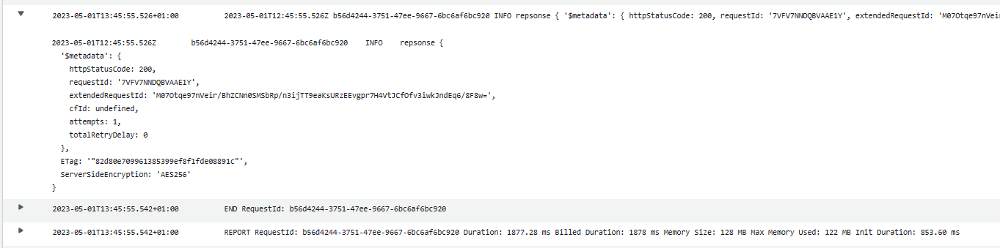
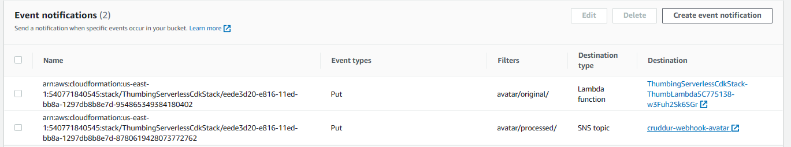
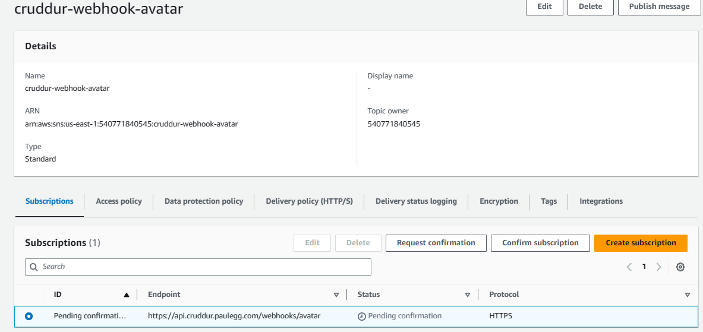

# Week 8 — Serverless Image Processing

## CDK Getting Started ##

CDK is an open source development framework that is used to write IaC. It can be used with a number of imperative programming languages such as Python, Typescript and Java.  We will use it in this project with Typescript to deliver the resources required for the Image Processing parts of the application.

### File Structure and npm install ##

First, we need a new directory to store all our CDK related stuff:

```sh
cd /workspace/aws-bootcamp-cruddur-2023
mkdir thumbing-serverless-cdk
```

Next, we need to install the npm module for `aws-cdk`:

```sh
npm install aws-cdk -g
```

Plus we need this to be installed on every new Gitpod environment we launch, so add the following to the `.gitpod.yml` (we will need the dotenv later too):

```yaml
  - name: cdk
    before: |
      npm install aws-cdk -g
      npm install dotenv
```

### Start a new project with cdk init ###

The way to initialize a new cdk project is as shown below, do this from within the new folder.  Note how we can pass the language to the command, as mentioned before, this could be python, java or other languages.

```sh
cdk init app --language typescript
```

## Adding the first resource - s3 ##

The best way to get started is to create the s3 bucket that we need for the image processing part of the project.  The deliver of an s3 bucket using CDK is really straight forward. Edit `thumbing-serverless-cdk/lib/thumbing-serverless-cdk-stack.ts` and add the following _after_ the constructor:

```typescript
  createBucket(bucketName: string): s3.IBucket {
    const bucket = new s3.Bucket(this, 'ThumbingBucket', {
      bucketName: bucketName,
      removalPolicy: cdk.RemovalPolicy.DESTROY

    });
    return bucket;
  }
```

We will need to import `aws-s3` at the top of the file:

```typescript
import * as s3 from 'aws-cdk-lib/aws-s3';
```

plus we will need to pull in the required environment variables and call our new function from inside the constructor:

```typescript
...
const bucketName: string = process.env.THUMBING_BUCKET_NAME as string;
    const bucket = this.createBucket(bucketName);
...
```

On the commmand line, if we add the environment variable to our shell (and persistent gitpod variables, we can test):

```sh
export THUMBING_BUCKET_NAME="cruddur-thumbs"
gp env THUMBING_BUCKET_NAME="cruddur-thumbs"
```

The full file currently looks like this:

```typescript
import * as cdk from 'aws-cdk-lib';
import * as s3 from 'aws-cdk-lib/aws-s3';
import { Construct } from 'constructs';

export class ThumbingServerlessCdkStack extends cdk.Stack {
  constructor(scope: Construct, id: string, props?: cdk.StackProps) {
    super(scope, id, props);

    // The code that defines your stack goes here

    const bucketName: string = process.env.THUMBING_BUCKET_NAME as string;
   
    const bucket = this.createBucket(bucketName);
    
  }

  createBucket(bucketName: string): s3.IBucket {
    const bucket = new s3.Bucket(this, 'ThumbingBucket', {
      bucketName: bucketName,
      removalPolicy: cdk.RemovalPolicy.DESTROY

    });
    return bucket;
  }
```

## bootstrapping ##

CDK requires some resources in your AWS account in order to operate.  To create this (a one-time, per-region task), we need to bootstrap the environment.  This is done as follows:

```sh
cdk bootstrap "aws://$AWS_ACCOUNT_ID/$AWS_DEFAULT_REGION"
```

Once that is done, go and look at your CloudFormation stacks in AWS, you should see a new cdk stack present.

## CDK synth ##

CDK leverages CloudFormation.  Fundamentally what is happening when you use CDK is that you are using an imperative programming language to build out CloudFormation stacks for you.  "Synthesising" a CF Stack is the first step in a CDK build process and you can (and should for testing) run the `cdk synth` process manually.

To run CDK synth and see the YAML output that represents the synthesised CloudFormation template, run this:

```sh
cdk synth
```

The output should look a little like this (truncated):

```sh
gitpod /workspace/aws-bootcamp-cruddur-2023/thumbing-serverless-cdk (main) $ cdk synth
Resources:
  ThumbingBucket715A2537:
    Type: AWS::S3::Bucket
    Properties:
      BucketName: paulegg-cruddur-thumbs
    UpdateReplacePolicy: Delete
...
```

## CDK deploy ##

Once you're happy with the output of the `cdk synth`, you are ready to run the deploy in order to actually create the resources you have developed in your Typescript code.  Run this:

```sh
cdk deploy
```

This should build and deploy your bucket. Go to the AWS console and check the cloud formation stacks to see.

The shell console should look something like this:

```sh
gitpod /workspace/aws-bootcamp-cruddur-2023/thumbing-serverless-cdk (main) $ cdk deploy

✨  Synthesis time: 8.37s

ThumbingServerlessCdkStack: building assets...

[0%] start: Building 796b68018ce7acbc0c09c44a6bd4e0080cca521b14ecff38b78b35daadcf7cec:current_account-current_region
[100%] success: Built 796b68018ce7acbc0c09c44a6bd4e0080cca521b14ecff38b78b35daadcf7cec:current_account-current_region

ThumbingServerlessCdkStack: assets built

ThumbingServerlessCdkStack: deploying... [1/1]
[0%] start: Publishing 796b68018ce7acbc0c09c44a6bd4e0080cca521b14ecff38b78b35daadcf7cec:current_account-current_region
[100%] success: Published 796b68018ce7acbc0c09c44a6bd4e0080cca521b14ecff38b78b35daadcf7cec:current_account-current_region
ThumbingServerlessCdkStack: creating CloudFormation changeset...

 ✅  ThumbingServerlessCdkStack

✨  Deployment time: 45.33s

Stack ARN:
arn:aws:cloudformation:us-east-1:540771840545:stack/ThumbingServerlessCdkStack/94d21850-e529-11ed-a29a-0af8609542bf

✨  Total time: 53.7s


...


```


##  Adding Lambda ##


First, just to test CDK and adding a Lambda I added a simple hello world Lambda to get started:

```typescript
exports.handler = function(event, context) {
    context.succeed("Hello, World!");
   };
```

Output:

```sh
IAM Statement Changes
┌───┬────────────────────────────────┬────────┬────────────────┬──────────────────────────────┬───────────┐
│   │ Resource                       │ Effect │ Action         │ Principal                    │ Condition │
├───┼────────────────────────────────┼────────┼────────────────┼──────────────────────────────┼───────────���
│ + │ ${ThumbLambda/ServiceRole.Arn} │ Allow  │ sts:AssumeRole │ Service:lambda.amazonaws.com │           │
└───┴────────────────────────────────┴────────┴────────────────┴──────────────────────────────┴───────────┘
IAM Policy Changes
┌───┬────────────────────────────┬────────────────────────────────────────────────────────────────────────────────┐
│   │ Resource                   │ Managed Policy ARN                                                             │
├───┼────────────────────────────┼────────────────────────────────────────────────────────────────────────────────┤
│ + │ ${ThumbLambda/ServiceRole} │ arn:${AWS::Partition}:iam::aws:policy/service-role/AWSLambdaBasicExecutionRole │
└───┴────────────────────────────┴────────────────────────────────────────────────────────────────────────────────┘
(NOTE: There may be security-related changes not in this list. See https://github.com/aws/aws-cdk/issues/1299)

Do you wish to deploy these changes (y/n)? y
ThumbingServerlessCdkStack: deploying... [1/1]
[0%] start: Publishing a053d6a01dd31d2892bb3ae3e75d1e735ecf499b5c278a054a21428c31422521:current_account-current_region
[0%] start: Publishing 932e44935f3f76104a4403cb03cfe399445e634d7f70110790bd61e4489c21cf:current_account-current_region
[50%] success: Published 932e44935f3f76104a4403cb03cfe399445e634d7f70110790bd61e4489c21cf:current_account-current_region
[100%] success: Published a053d6a01dd31d2892bb3ae3e75d1e735ecf499b5c278a054a21428c31422521:current_account-current_region
ThumbingServerlessCdkStack: creating CloudFormation changeset...

 ✅  ThumbingServerlessCdkStack

✨  Deployment time: 56.56s

Stack ARN:
arn:aws:cloudformation:us-east-1:540771840545:stack/ThumbingServerlessCdkStack/94d21850-e529-11ed-a29a-0af8609542bf

✨  Total time: 62.96s
```

## The real lambda ##

In `aws/lambdas/thumbLambda` is the lambda code for the image processing.

You will need to add the node modules required for the Lambda in that location:

```sh
npm i sharp
npm i @aws-cdk/s3-client
```

That will create the `node_modules` directory and place the dependencies into `package.json`

```json
...
  "dependencies": {
    "@aws-sdk/client-s3": "^3.321.1",
    "sharp": "^0.32.1"
  }
...
```

Next, go back to the thumbing stack and re-run `cdk deploy`

## sharp for Lambda ##

There are some additional requirements to complete for sharp on Lambda see [here](https://sharp.pixelplumbing.com/install)

It recommends for Lambda:

```sh
npm install
rm -rf node_modules/sharp
SHARP_IGNORE_GLOBAL_LIBVIPS=1 npm install --arch=x64 --platform=linux --libc=glibc sharp
```

I wrote a function for this that works from anywhere in the tree and returns you to your original location:

```sh
rebuild-sharp () {
  cd ${GIT_ROOT}/thumbing-serverless-cdk
  npm install
  rm -rf node_modules/sharp
  SHARP_IGNORE_GLOBAL_LIBVIPS=1 npm install --arch=x64 --platform=linux --libc=glibc sharp
  cd -
}
```

As usual, this is in the `aliases` file and will need sourcing.

## Create S3 Event notification to Lambda via CDK ##

To "connect" the S3 bucket to Lambda so that upload (PUT) events trigger the Lambda we add this to the `thumbing-serverless-cdk-stack.ts` file:

```typescript
  createS3NotifyToLambda(prefix: string, lambda: lambda.IFunction, bucket: s3.IBucket): void {
    const destination = new s3n.LambdaDestination(lambda);
    bucket.addEventNotification(
      s3.EventType.OBJECT_CREATED_PUT,
      destination,
      {prefix: prefix}
    )
  }
```

Also, in the constructor, so that this gets called:

```typescript
this.createS3NotifyToLambda(folderInput,lambda,bucket)
```

Test this with `cdk synth`, review the output and then `cdk deploy`

Once deployed, check the Cloud Formation stacks and also the Lambda in the console - you should see the linked bucket:


## Change bucket from create to import ##

So that we can 'keep' our bucket but destroy and redeploy our CDK stack, it is necessary to import an existing bucket on `cdk deploy` rather than create/destroy.  I set the `cdk.RemovalPolicy` to `RETAIN` and then I destroyed the stack.  Then I implemented import:

```typescript

...
    //const bucket = this.createBucket(bucketName);
    const bucket = this.importBucket(bucketName);
...


importBucket(bucketName: string): s3.IBucket {
    const bucket = s3.Bucket.fromBucketName(this, 'ThumbingBucket', bucketName);
    return bucket;
  }

...

```

Which allows the import of the bucket when the stack is launched.

## Image Upload Shortcut ##

Now that we have a persistent bucket, we can write a quick function to upload / seed our image(s) into the 'original' folder.

```sh
upload-s3-image () { 
  echo "aws s3 cp ${GIT_ROOT}/images/${1} s3://assets.cruddur.paulegg.com/avatar/original/"
  aws s3 cp "${GIT_ROOT}/images/${1}" s3://assets.cruddur.paulegg.com/avatar/original/
}
```

Testing:

```sh
 $ upload-s3-image data.jpg
aws s3 cp /workspace/aws-bootcamp-cruddur-2023/images/data.jpg s3://assets.cruddur.paulegg.com/avatar/original/
upload: images/data.jpg to s3://assets.cruddur.paulegg.com/avatar/original/data.jpg
```

There is also a "clear" function that does this :

```sh
 $ clear-s3-image data.jpg
aws s3 rm s3://assets.cruddur.paulegg.com/avatar/original/data.jpg
aws s3 rm s3://assets.cruddur.paulegg.com/avatar/processed/data.png
```

## Add Role Policy ##

In order to give the Lambda access to write to the bucket, I create and add a new IAM Policy on the bucket:

```typescript
  createPolicyBucketAccess(bucketArn: string){
    const s3ReadWritePolicy = new iam.PolicyStatement({
      actions: [
        's3:GetObject',
        's3:PutObject',
      ],
      resources: [
        `${bucketArn}/*`,
      ]
    });
    return s3ReadWritePolicy;
  }
```
Back in the constructor:

```typescript
    const s3ReadWritePolicy = this.createPolicyBucketAccess(bucket.bucketArn)
    lambda.addToRolePolicy(s3ReadWritePolicy);
```


## TESTING ##

At this stage, I am ready to test the upload, the Lambda function triggers on PUT and the image is processed by the lambda and placed into 'processed' !!!



The image is a PNG and is 512x512 - success!

```sh
$ aws s3 ls --recursive s3://assets.cruddur.paulegg.com/avatar/
2023-05-01 11:51:54          0 avatar/
2023-05-01 11:52:10          0 avatar/original/
2023-05-01 13:19:41      71593 avatar/original/data.jpg
2023-05-01 11:52:17          0 avatar/processed/
2023-05-01 13:19:44     557213 avatar/processed/data.png
```

## Adding SNS ##

Now time to implement the SNS Topic.

Added the following calls to the constructor in the .TS file (`thumbing-serverless-cdk-stack.ts`).  With, of course, corresponding function implementations and required imports.  Refer to the file for complete info:

```typescript
...
    const snsTopic = this.createSnsTopic(topicName)
    this.createSnsSubscription(snsTopic,webhookUrl)

    // Create required Policies
    const snsPublishPolicy = this.createPolicySnSPublish(snsTopic.topicArn)

    // S3 Events
    this.createS3NotifyToSns(folderOutput,snsTopic,bucket)
    
    lambda.addToRolePolicy(snsPublishPolicy);
...
```

The SNS Topic is ready, pending confirmation:





## CloudFront ##

I configured CloudFront for the assets bucket (assets.cruddur.paulegg.com) using the AWS console.  CF provides a bucket access policy for the bucket when this is completed.  I've placed the policy in `aws/policies/s3-cloudfront.json`.

Apply it with:

```sh
aws s3api put-bucket-policy --bucket assets.cruddur.paulegg.com --policy file://s3-cloudfront.json
```
My distribution name is:

https://djrx6ekko46j2.cloudfront.net

Try:  https://djrx6ekko46j2.cloudfront.net/avatar/original/data.jpg

Access should be permitted, not denied if all is well.

Need to create a Route 53 CNAME for this.  In R53, create a new record - `assets.cruddur.paulegg.com` and set it to an Alias to CloudFront.  Select the distribution as above (the equivalent in your case).

## Changes to S3 Buckets ##

I changed the upload (original) destination to a new bucket with no path expected for the original upload location (so, images will be uploaded to `s3://cruddur-paulegg-uploaded-avatars/data.jpg`).  The lambda function needed a small edit to ensure it handled the new location and processed accordingly:

```diff
   const dstBucket = bucketName;
-  const origDstKey = srcKey.replace(folderInput,folderOutput)
+  const origDstKey = folderOutput + srcKey
   const dstKey= origDstKey.replace("jpg", "png");
   console.log('dstBucket',dstBucket)

```

Testing was successful.